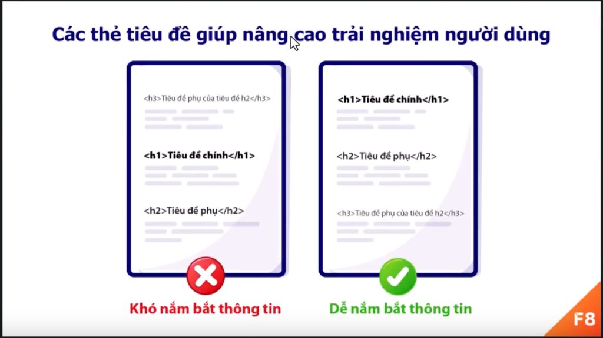
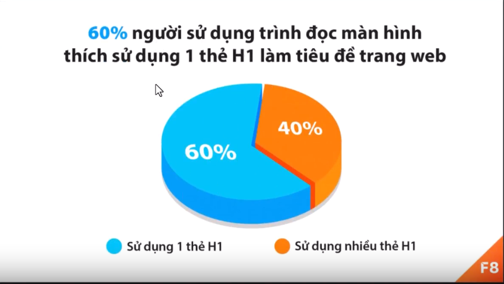

# Bài 3.1 Thẻ tiêu đề h1

Trong html có 6 thẻ tiêu đề h1 - h6. con số trong thẻ thể hiện cấp độ(tiếng anh:level) của thẻ, cấp độ ở đây là việc ưu tiên thứ tự sử dụng thẻ. Trong đó cấp 1 là ưu tiên cao nhất, cấp 6 là ưu tiên thấp nhất.

Thẻ h1 được sử dụng làm tiêu đề chính cho trang web. Đây là phần tiêu đề nổi bật nhất, đễ thấy nhất, mang thông điệp ngắn gọn giúp người dùng và công cụ tìm kiếm hiểu trang web của bạn nói về điều gì.

Giúp công cụ tìm kiếm hiểu nội dung trang web

John Mueller của google nói rằng thẻ h1 giúp google hiểu cấu trúc & nội dung của một trang web. Vì vậy, bạn nên sử dụng thẻ h1 cho tiêu đề chính cho web của bạn nhé.

Nâng cao trải nghiệm người dùng

```

```
Trong nhiều trường hợp, thẻ h1 là một phần trong cấu trúc phân cấp của trang web. Trong đó thẻ h1 là tiêu đề nổi bật nhất sau đó là h2 h3,...

- nâng cao khản năng tiếp cận 
+ Khả năng tiếp cận cho trang web (tiếng anh: web accessibility) đề cập tới việc thiết kế các trang web đáp ứng nhu cầu cho mọi người, bao gồm cả người khuyết tật.
+ Vì vậy, ta cso thể hiểu ngắn gọn "web accessibility" là các phương án để làm cho mọi người, bao gồm cả người khuyết tật, đề có thể dễ dàng truy cập và sự dụng trang web.
+ theo nghiên cứu của web AIM 60% người dùng trình đọc màn hình thích tiêu đề trang web là 1 thẻ h1 


Tóm tắt 
- Nội dung thẻ h1 giúp Google hiểu về cấu trúc & nội dung trang web 
- Chỉ nên sử dụng tối đa 1 thẻ h1 trong 1 trang
- Nên sử dụng thẻ h1 cho tất cả các trang quan trọng
- Thẻ h1 giúp nâng cao trải nghiệm người dùng và khản năng tiếp cận (tiếng anh:web accessibility) cho trang web. Giúp mọi người, bao gồm cả người khuyết tật có thể dễ dàng sử dụng trang web

# Bài 3.2 Tìm hiểu thẻ h2 

Thẻ h2 được sử dụng làm tiêu đề của phần chính trong một trang web.Thẻ h2 được sử dụng làm tiêu đề con của thẻ h1

```
<!-- Ví dụ -->
<h1>Lộ trình học</h1>
<h1>Lộ trình học Frontend</h1>
<h1>Lộ trình học Backend</h1>
```

Lưu ý, thẻ h2 được dùng làm tiêu đề con của thẻ h1 ở đây nghĩa là về mặt trình bày và ý nghĩa sử dụng, không phải đề cập tới việc sử dụng thẻ h2 vào bên trong thẻ h1

Ví dụ sử dụng sai

```
<h1>
    lộ trình học
    <h2>lộ trình học Frontend</h2>
    <h2>lộ trình học Backend</h2>
</h1>
```


Cấu trúc phân cấp

- Sự kết hợp của các thẻ h trong một trang web giúp tại nên hệ thông phân cấp về nội dung. giúp người dử dụng và các công cụ tìm kiếm sẽ dễ dàng xác định được bố cục của một trang web 


Tham khảo
- Chính bài học này (cuộn lên đầu bài viết)

Để tự xác định được cấu trúc thẻ h, đơn giản bạn chủ cần nghĩ như lúc đang viết một bài blog
<ul>
    <li>Tiêu đề chính của bài blog dùng thẻ h1</li>
    <li>Các phần chính trong bài blog dùng thẻ h2</li>
    <li>Các ý phụ trong mỗi phần dùng thẻ h3</li>
    <li>Tương tự như vậy cho đến thẻ h6</li>
</ul>

Trong thực tế, cũng hiếm khi chúng ta phải sử dụng thẻ h6. vì các nội dung thường có từ 1 - 4 cấp độ. vậy nên chúng ta sẽ thường thấy thẻ h1 - h4 được sử dụng. Trong đó, thẻ h1 - h2 thường xuyên được sử dụng hơn cả

Xác định các thẻ tiêu đề bằng ý nghĩa nội dung của nó, không phải dựa trên kích thước của nó. Bời vì kích thước còn phụ thuộc vào thiết kế và cách sử dụng CSS, CSS còn có thể thay đổi kích thước của thẻ

Tóm tắt

- Sử dụng thẻ h2 làm tiêu đề các phần chính trong trang web, đây được coi là tiêu đề h1
- Không sử dụng các thẻ h lồng nhau
- Các thẻ h được sử dụng để tạo hệ thống phân cấp nội dung
- Xác định các thẻ tiêu đề bằng ý nghĩa nội dung của nó, không phải dựa trên kích thước của nó

# Bài 3.3 Thẻ tiêu đề h3, h4, h5, h6 

## Thẻ h3 - h6

Qua các bài học trước, chúng ta đã được tìm hiểu chi tiết về thẻ \<h1>, \<h2>. Trong bài này, chúng ta sẽ tìm hiểu về các thẻ h còn lại
- h3
- h4
- h5
- h6

Tương tự như cách thẻ \<h2> liên quan tới thẻ \<h1>

- Thẻ \<h3> là tiêu đề con của thẻ \<h2>
- Thẻ \<h4> là tiêu đề con của thẻ \<h3>
- Thẻ \<h5> là tiêu đề con của thẻ \<h4 >
- Thẻ \<h6> là tiêu đề con của thẻ \<h5 >

Các thẻ càng gần h6 càng ít được sử dụng. Bạn cũng cần phải sử dụng tất cả các thẻ h, nps tùy thuộc vào nội dung bạn muốn thể hiện.

Mục tiêu của việc sử dụng thẻ h là để tạo ra cấu trúc phân cấp nội dung cho trang web của bạn. Giúp người dung và các công cụ tìm kiếm có thể dễ dàng hiểu được nội dung mà trang web đang đề cập,

## Tránh bỏ qua các cấp độ

Khi sử dụng các thẻ h, bạn cần tránh bỏ qua các cấp độ tiêu đề. Nếu bạn đang sử dụng thẻ h1, thì sau đó nên là h2. Tránh bỏ qua thẻ h2 mà đi tới thẻ h3. Tương tự như vậy đến thẻ h6


## Các thẻ tiêu đề và SEO

Tối ưu hóa công cụ tìm kiếm (tiếng Anh: Search Engine Optimization - SEO) là hoạt động tối ưu trang web nhằm nâng cao thứ hạng trang web trong kết quả của công cụ tìm kiếm.

Các tiêu đề có vai trò quan trọng trong SEO, nó cung cấp nội dung từ khóa và cấu trúc phân cấp nội dung trang web cho các công cụ tìm kiếm. Từ đó, các công cụ tìm kiếm như Google Search có thể đánh giá, phân tích và xếp hạng cho trang web.

Bạn có thể thử tìm kiếm trên Google:
- học html css
- học javascript

Bạn sẽ thấy trang web fullstack.edu.vn của F8 được xếp hạng đầu tiên. Việc sử dụng các thẻ tiêu đề là một trong những điểm quan trọng giúp Google hiểu được nội dung của trang web của F8.

Tóm tắt
- Trong HTML có r thẻ tiêu đề từ h1 - h6. Trong đó h1 là cấp cao nhất, h6 là cấp thấp nhất.
- Các thẻ càng gần với h6 càng ít được sử dụng. Bạn Cũng không cần phải sử dụng tất cả các thẻ h, nó túy thuộc vào nội dung bạn muốn thể hiện.
- Tránh bỏ qua các cấp độ tiêu đề. Nếu bạn đang sử dụng thẻ h1, thì sau đó nên sử dụng thẻ h2. Tránh bỏ qua thẻ h2 mà đi tới thẻ h3
- Các tiêu đề có vai trò quan trọng trong SEO, nó cung cấp nội dung từ khóa và cấp trúc phân cấp nội dung trang web cho các công cụ tìm kiếm.

# Bài 3.4 Những sai lầm thường gặp 

## Sử dụng nhiều thẻ h1 trên cùng một trang

Thẻ \<h1> nên được sử dụng cho tiêu đề cho trang web hiện tại của bạn và nên đặt ở đầu phần nội dung của bạn.Nếu bạn có một trang nói chi tiết sản phẩm laptop DELL XPS 9710x thì bạn nên sử dụng thẻ \<h1> với tên sản phẩm đó:

```
<h1>Laptop DELL XPS 9710x</h1>
```

Nếu sau đó bạn có đề cập tới một chiếc laptop khác Laptop Razer 15 2022 thì bạn nên có một trang riêng cho sản phẩm đó với tên của nó nằm trong thẻ \<h1>

## Sử dụng thẻ h vì nó phù hợp với kích thước phông chữ.

Lỗi này gặp chủ yếu do các nhà phát triển trang web chưa biết cách sử dụng đúng các tiêu đề. Ví dụ họ không sử dụng thẻ \<h1> chỉ vì nó quá lớn so với thiết kế mà họ đang tìm kiếm, nên họ sử dụng thẻ \<h2> hoặc \<h3>.

Tuy nhiên, bạn cần sử dụng CSS để tạo kiểu cho các tiêu đè theo cách chúng ta muốn, vì vậy kích thước phông chứ không nên được dùng để xem xét khi quyết định lựa chọn cho các thẻ tiêu đề.

## Không tuân thủ cấu trúc tiêu đề

Tất cả các tiêu đề nên tuân thẻ theo một cấu trúc rõ ràng. Vì vậy, một \<h2> phải theo sau một \<h1>, một \<h3> phải theo sau một \<h2>,... Bạn tránh quên điều này và hãy nhớ thêm rằng bạn có thể dễ dàng thay đổi kích thước của các thẻ tiêu đề bằng CSS.

Ví dụ, sau đây là một cấu trúc tiêu đề tốt:

- \<h1> Thú Cưng phổ biến ở việt nam \</h1>
    + \<h2> Chó Husky ở việt nam \</h2>
        + \<h3> Chế độ ăn kiêng của cho Husky \</h3> 
        + \<h3> Đặc điểm của chó Husky \</h3> 
    + \<h2> Chuột Hamster ở việt nam \</h2>
        + \<h3> Chế độ ăn kiêng cho chuột Hamster \</h3> 
        + \<h3> Đặc điểm của chuột Hamster \</h3> 

Ví dụ trên có thể không chính xác khi nói chó Husky và chuột Hamster ở việt nam. Nó chỉ là ví dụ, chúng ta sẽ không xét về việc 2 loài này có ở việt nay thật hay không nhé.

## Hoàn toàn không sử dụng thẻ tiêu đề

Điều này thường xẩy ra khi nhà phát triển web chưa hiểu được ý nghĩa và tầm quan trọng của việc sử dụng các thẻ tiêu đề.

Kết hợp sử dụng các thẻ tiêu đề giúp tạo cấu trúc phân cấp nội dung. giúp người dùng và công cụ tìm kiếm dễ dàng nắm bắt được nội dung trang web của bạn.

## Sử dụng tiêu đề cho nội dung không phải tiêu đề

Sử dụng thẻ tiêu đề cho nội dung không phải tiêu đề

Điều này thường xảy ra trong quá khứ, các nhà phát triển trang web thường sử dụng các “tricks” để “đánh lừa” công cụ tìm kiếm. Bởi vì họ biết rằng công cụ tìm kiếm sẽ ưu tiên cho các nội dung trong thẻ h, họ thường spam các từ khóa cần SEO trong các thẻ h trên trang web.

Ngày nay, các công cụ tìm kiếm đã rất thông minh. Các “tricks” spam từ khóa trong các thẻ h không mang lại tác dụng, thậm chí còn phản tác dụng.

Nếu bạn cần lời khuyên cho việc làm SEO tốt. Mình khuyên các bạn nên chú trọng tới việc mang lại nội dung có giá trị thực sự cho người sử dụng. Các công cụ tìm kiếm ngày nay đủ thông minh để đánh giá được trang web của các bạn thực sự tốt cho người dùng, từ đó nâng cao thứ hạng của trang web trong kết quả tìm kiếm.

Tóm tắt
- Nên sử dụng tối đa một thẻ \<h1> trên cùng 1 trang.
- Không sử dụng thẻ h chỉ vì nó phù hợp với kích thước phông chữ.
- Nên tuân thủ cấu trúc của các thẻ h để tạo ra cấu trúc phân cấp cho nội dung trang web.
- Làm SEO tốt là mang lại giá trị nội dung đích thực cho người dùng. không nên spam các từ khóa trong các thẻ tiêu đề nhằm "đánh lừa" công cụ tìm kiếm. 