#  CHỦ ĐỀ 1: MỘT SỐ KHÁI NIỆM VỀ LẬP TRÌNH VÀ NGÔN NGỮ LẬP TRÌNH

## I. KHÁI NIỆM LẬP TRÌNH VÀ NGÔN NGỮ LẬP TRÌNH.

Như ta biết, mọi bài toán có thuật toán đều có thể giải được trên máy tính điện tử. Khi giải bài toán trên máy tính điện tử. Khi giải bài toán trên máy tính điện tử, sau các bước xác định bài toán và xây dựng hoặc lựa chọn thuật toán khả thi là bước lập trình.

Lập trình là sử dụng cấu trúc dữ liệu và các câu lệnh của ngôn ngữ lập trình cụ thể mô tả dữ liệu và diễn dạt các thao tác của thuật toán. Chương trình viết bằng ngôn ngữ lập trình bậc cao nói chung không phụ thuộc vào loại máy, nghĩa là một chương tình có thể thực hiện trên nhiều loại máy tính khác nhau. Chương trình viết bằng ngôn ngữ máy tính có thể được nạp trực tiếp vào bộ nhớ và thực hiện ngay, còn chương trình việt bằng ngôn ngữ lập trình bậc cao phải được chuyển đổi thành chương trình trên ngôn ngữ mãy mới có thể thực hiện được.

Chương trình đặc biệt có chức năng chuyển đổi chương trình được viết bằng ngôn ngữ lập trình bậc cao thành chương trình thực hiện được trên máy tính được gọi là chương trình dịch.

Chương trình dịch nhân đầu vào là chương trình viết bằng ngôn ngữ lập trình bậc cao (chương trình nguồn), thực hiện chuyển đổi sang ngôn ngữ máy (chương trình đích).


Xét ví dụ, bạn chỉ biết tiếng việt nhưng cần giới thiệu về trường của mình cho đoàn khác đến từ nước Mĩ, chỉ bằng tiếng anh. Có hai cách để bạn thực hiện điều này.

Cách thứ nhất: Bạn nói bằng tiếng việt và người phiên dịch giúp bạn dịch sang tiếng Anh. Sau mỗi câu hoặc một vài câu giới thiệu trọn một ý, người phiên dịch sang tiếng Anh cho đoàn khách. Sau đó, bạn lại giới thiệu tiếp và người phiên dịch lại dịch tiếp. Việc giới thiệu của bạn và việc dịch lại dịch tiếp. Việc giới thiệu của bạn và việc dịch của người phiên dịch luân phiên cho đến khi bạn kết thúc nội dung giới thiệu của mình. Cách dịch trực tiếp như nậy gọi là thông dịch.

Cách thứ hai: Bạn soạn nội dung giới thiệu của mình ra giấy, người phiên dịch dịch toàn bộ nội dung đó sang tiếng Anh rồi đọc hoặc trao văn bản đã dịch cho đoàn khách đọc. Như vậy, việc dịch được thực hiện sau khi nội dung giới thiệu đã hoàn tất. Hai công việc đó được thực hiện trong hai khoảng thời gian độc lập, tách biệt với nhau. Cách dịch như vậy được gọi là biên dịch.

Sau khi kết thúc, với cách thứ nhất không có một văn bản nào để lưu trữ, còn với cách thứ hai có hai bản giới thiệu về trường của bạn bằng tiếng Việt và bằng tiếng Anh có thể lưu trữ để dùng lại về sau.

Tương tự như vậy, chương trình dịch có hai loại là _thông dịch_ và _biên dịch_

a) Thông dịch

Thông dịch (interpreter) được thực hiện bằng cách lặp lại dãy các bước sau:

1. Kiểm tra đúng đắn của câu lệnh tiếp theo trong chương trình nguồn.
2. Chuyển đổi câu lệnh đó thành một hay nhiều câu lệnh tương ứng trong ngôn ngữ máy
3. Thực hiện các câu lệnh vừa chuyển đổi được.

Như vậy, quá trình dịch và thực hiện các câu lệnh là luân phiên. Các chương tình thông dịch lần lượt dịch và thực hiện từng câu lệnh. Loại chương tình dịch này đặc biệt thích hợp cho môi trường đối thoại giữa người dùng và hệ thống. Tuy nhiên, một câu lệnh nào đó phải thực hiện bao nhiêu lần thì nó phải được dịch bấy nhiêu lần.

Các ngôn ngữ khai thác hệ quản trị cơ sở dữ liệu, ngôn ngữ đối thoại với hệ điều hành,... đều sử dụng trình thông dịch.

b) Biên dịch

Biên dịch (compiler) được thực hiện qua hai bước: 
1. Duyệt, phát hiện lỗi, kiểm tra tính đúng đắn của các câu lệnh trong chương trình nguồn.
2. Dịch taofn bộ chương trình nguồn thành một chương trình đích có thể thực hiện trên máy tính và có thể lưu trữ để sử dụng lại khi cần thiết.

Như vậy, trong thông dịch, không có chương trình đích để lưu trữ, trong biên dịch cả chương trình nguồn và chương trình đích có thể lưu trữ để sử dụng về sau.

Thông thường, trong môi trường làm việc trên một ngôn ngữ lập trình cụ thể, ngoài chương trình dịch còn có một số thành phần có chức nang liên quan như biên soạn, lưu trữ, tìm kiếm, cho kết quả trung gian,...

Các môi trường lập trình khác nhau ở những dịch vụ mà nó cung cấp, đặc biệt là dịch vụ nâng cấp. tăng cường các khả năng mới cho ngôn ngữ lập trình.

Bài tập tự luận
1. Tại sao người ta phải xây dựng các ngôn ngữ lập trình bậc cao?
2. Chương trình dịch là gì? Tại sao cần phải có trình dịch?
3. Biên dịch và thông dịch khác như thế nào?

## II. CÁC THÀNH PHẦN CỦA NGÔN NGỮ LẬP TRÌNH
### 1. Các thành phần cơ bản

Mỗi ngôn ngữ lập trình thường có ba thành phần cơ bản là bảng chữ cái, cú pháp và ngữ nghĩa.

a) Bảng chữ cái là tập các kí tự được dùng để viết chương trình. Không được phép dùng bất kì kí tự nào ngoài các kí tự quy định trong bảng chữ cái.

Trong Python, bảng chữ cái bao gồm các kí tự sau:
- Các chữ thường và các chữ cái in hoa của bảng chữ cái tiếng Anh:


- 10 chữ số thập phân Ả Rập:


- Các kí tự đặc biệt


dấu cách (mã ASCII 32)    _

Lưu ý thêm: python sử dụng mặc định bảng mã Unicode thay vì ASCII như Pascal. Như vậy, khái niệm "bảng chữ cái" trong Python là các kí tự trong bảng mã Unicode. Tên biến và các đói tượng trong chương trình python có thể đặt bằng tiếng việt có dấu.

b) Cú pháp là bộ quy tắc để chương trình.

Dựa vào chúng, người lập trình và chương trình dịch biết được tôt hợp nào của các kí tự trong bảng chữ cái là hợp lệ và tổ hợp nào là không hợp lệ. Nhờ đó, có thể môt tả chính xác thuật toán để máy thực hiện.

C) Ngữ nghĩa xác định ý nghĩa thao tác cần phải thực hiện, ứng với tổ hợp kí tự dựa nào ngữ cảnh của nó.

Ví dụ 

Phần lớn các ngôn ngữ lập trình đều sử dụng dấu (+) để chỉ cộng phép cộng. Xét các biểu thức:


Giả thiết A,B là các đại lượng nhận giá trị thực và I,J là các đại lượng nhận giá trị nguyên. Khi đó dấu "+" trong biểu thức (1) được hiểu là cộng hai số thực, dấu "+" trong biểu thức (2) được hiểu là cộng hai số nguyên. Như vậy ngữ nghĩa dấu "+" trong hai ngữ cảnh khác nhau là khác nhau.

Tóm lại, cú pháp cho biết cách viết một chương trình hợp lệ, còn ngữ nghĩa xác định ý nghĩa của các tổ hợp kí tự trong chương trình. 

Các lỗi cú pháp được chương tình dịch phát hiện và thông báo cho người lập trình biết. Chỉ có các chương trình không còn lỗi cú pháp mới được dịch sang ngôn ngữ máy.

Các lỗi ngữ nghĩa khó phát hiện. Phần lớn các lỗi nghữ nghĩa chỉ được phát hiện khi thực hiện chương tình trên dữ liệu cụ thể.

### 2. Một số khái niệm

a) Biến nhớ

Có thể tóm tắt quy tắc đặt tên biến nhớ trong Python như sau:

- Phân biệt chứ hoa và chữ thường.
- chỉ có thể chữa kí tự là chữ, chữ số, dấu gạch dưới và không cho phép chứa bất kì các ký tự khác.
- Tên biến nhớ phải bắt đầu bằng chữ cái hoặc dấu _ (dấu gạch dưới), không được phép bắt đầu bằng chữ số.

Ví dụ Các tên biến sau là hợp lệ: ab_1, _ bien_nho, xyz, x_y_z.

b) Từ khóa

Từ khóa được định nghĩa sẵn để sử dụng. Chúng ta không thể dùng keyword để đặt tên biến, tên hàm hoặc bất kỳ đối tượng nào trong chương trình.

Tất cả các keyword trong Python đều được viết thường, Trừ 03 keyword: True, False, None.

Thực tế thì không cần nhớ keyword vì khi gõ trình soạn thảo sẽ gợi ý các keyword (ta tránh đặt tên đối tượng trùng với các keyword được gợi ý) và nếu đặt trùng tên keyword thì khi chạy chương trình sẽ báo lỗi.

Từ khóa là các từ mà Python đã dùng cho các mục đích riêng của ngôn ngữ hoặc dành cho các hàm hệ thống.

Sau đây là các từ khóa có trong chương trình học.


c) Ghi chú trong chương trình

Có thể dặt các đoạn chú thích trong chương tình nguồn. Các chú thích này giúp cho người đọc chương trình nhận biết ý nghĩa của chương trình đó dễ hơn. Chú thích không ảnh hưởng đến nội dung chương trình nguồn và được chương trình dịch bỏ qua.

Ghi chú (comment) lệnh trong Python được bắt đầu bằng ký tự # và có tác dụng từ vị trí này đến cuối dòng hiện thời.

Ví dụ một cách ghi chú lệnh trong Python.

``` python
x = 2 # gán 2 cho biến x
print(x)
```
> 2

Còn đây là ghi chú sai

``` python
/* ghi chú */
SyntaxError: invalid syntax

x = 2 /* ghi chú */
SyntaxError: invalid syntax
```

BÀI TẬP TỰ LUẬN

1. hãy cho biết các điểm khác nhau giữa biến nhớ và từ khóa.
2. Có thể đặt tên biến nhớ trùng với từ khóa của Python hay không?
3. Đặt tên biến nhớ như sau có được không

    a) a-b-c

    b) a_b_c

    c) _ \_abc\_ _
    
    d) -a_b_c-

4. Các tên sau có hợp lý trong Python không?

    a) 1_abc

    b) A.B.C

    c) _ _ \_1\_

    d) 1.abc

    e) a&b&c

5. Đặt tên các biến nhớ như sau có hợp lệ không?
    
    a) None

    b) none

    c) Việt Nam

    d) x y z

    e) True

    f) happy-day

## III. LÀM QUEN VỚI MÔI TRƯỜNG TƯƠNG TÁC PYTHON

### 1.Kiểu dữ liệu trong Python

a. Lệnh type() và kiểu dữ liệu chính trong Python.

Lệnh type(\<data>) sẽ trả lại kiểu dữ liệu hiện thời của \<data>

Quan sát và thực hiện các lệnh sau.


Các kiểu dữ liệu cơ bản trong Python bao gồm:

- int: số nguyên.
- float: số thực với dấu phẩy động.
- bool: logic với 2 giá trị True và False.
- str: xâu kí tự.

b) Biến nhớ không cần khai báo và xác định kiểu dữ liệu

Một đặc điểm đặc biệt của Python là các biến nhớ không cần khai báo và không cần xác định kiểu dữ liệu trước.

Cùng xem đoạn chương trình sau:


Ở dòng đầu tiên khi gõ x, Python sẽ khong nhận ra vì x chưa được gán bất cứ giá trị nào. Ở lần tiếp theo khi đã gán x = 1 thì biến nhớ x đã được xác định.

Trong Python, các biến nhớ chỉ xác định kiểu dữ liệu tại thời điểm gán trị, do đó biến nhớ không cần khai báo kiểu dữ liệu trước. Một biến nhớ có thể nhận nhiều kiểu giá trị khác nhau mà không cần khai báo lại.

Xem đoạn chương trình sau, biến nhớ x có thể nhận các giá trị với kiểu dữ liệu lần lượt là float, int, bool và str.


### 2 Biểu thức số học trong Python

Biểu thức số học trong Python có thể được viết và tính dễ dagnf như trong mọi ngôn ngữ lập trình bậc cao khác. Biểu thức có thể chứa giá trị số hoặc biến nhớ, hàm số có giá trị.

Xét các ví dụ sau:


Bảng các phép tính trong Python như sau: 


Chú ý: Biểu thức số học có dạng tương tự như cách viết tỏng toán học với những quy tắc sau

- Chỉ dùng cặp ngoặc tròn để xác định trình tự thực hiện phép toán trong trường hợp cần thiết;

- Không được bỏ qua dấu nhân (*) trong tích.

- Trong một số trường hợp nên dùng biến trung gian để có thể tránh được việc tính một biểu thức nhiều lần.

Riêng phép lũy thừa ** được tính từ phải qua trái

Ví dụ


Trong biểu thức có cả +, - và *, /, //, % thì phép nhân, chia, % được ưu tiên hơn cộng, trừ.

> 2 + 2/2 = 3.0

Phép tính lấy số dư % và chia nguyên // nếu số chia hoặc số bị chia là kiểu float thì kết quả sẽ chuyển đổi sang kiểu float. Ví dụ:


Dãy các biểu thức có thẻ viết trên một dòng lệnh, cách nhau bởi dấu phẩy như sau: 


Trong ví dụ trên nếu biểu thức phân cách bởi dấu ";" thì Python sẽ hiểu là các lệnh khác nhau và kết quả sẽ như nhau:


### 3. Hàm số học chuẩn

Để sử dụng các hàm này trong Python chúng ta thực hiện lệnh import math.

Ví dụ. Trước khi dùng hàm sqrt() ta phải thực hiện import module math như sau: 


Lưu ý: Hàm abs(x) có sẵn, không thuộc module math.


### 4. Dữ liệu kiểu bool

Dữ liệu kiểu bool (logic) là loại dữ liệu chỉ có 2 giá trị Đúng (True) và Sai (False). Dữ liệu bool được dùng khi mô tả các ddieuf kiện hoặc phép so sánh số hoặc chữ.

Trong Python, 2 giá trị chính của kiểu dữ liệu này là True và False. Hàm bool() sẽ kiểm tra xem giá trị của đối số của hàm là True hay False

Cùng xem một số ví dụ sau.


Ở lệnh đầu tiên, khi gõ 3 > 2, đó chính là một biểu thức logic với phép so sánh, biểu thức này có giá trị bool là True (đúng).

Ở lệnh thứ hai, phép gán x = 2 > 3, biểu thức logic 2 > 3 nhận giá trị False được gán cho biến nhớ x và x sẽ nhận giá trị False (sai).

Phép so sanh số là cách đơn giản nhất để tạo ra các kiểu dữ liệu logic này. Bảng sau mô tả quy tắc ghi các phép so sánh số trong Python.


Có 3 phép toán chính với kiểu dữ liệu bool là and (và), or (hoặc), và not (phủ định).

Bảng giá trị của các phép toán này được định nghĩa như sau.

Phép toán và and


Phép toán hoặc or 


Phép toán phủ định not


Phép toán not được viết trước biểu thức cần phủ định, ví dụ:

not (x < 1) thể hiện phát biểu "x không nhỏ hơn 1" và điều này tương đương với biết thức quan hệ x >= 1.

Các phép toán not, and và or có thể được dùng chung với nhau. Thứ tự ưu tiên của các phép toán này là not > and > or.

### 5. Câu lệnh gán

a) Lệnh gán

Lệnh gán đơn giản nhất của Python có dạng:

\<biến nhớ> = \<giá trị>

Ví dụ:


Chúng ta đã biết kiểu của biến nhớ chỉ được xác định tại thời điểm thực hiện lệnh gán.

Trong ví dụ sau, ban đầu x và y được gián các giá trị nguyên, do đó sẽ có kiểu int. Nhưng ở lần sau, y được gán một phép tính thực, và do đó y sẽ nhận kiểu giá trị float.


b) Gán đồng thời

Nếu các biến nhớ có giá trị bằng nhau thì có thể gán bằng một lệnh như sau:


Việc gán đồng thời nhiều biến nhớ với cá giá trị khác nhau có thể thực hiện như sau:


Chú ý: không được viêt như sau, ví dụ: x = 1, y = 2, z = 3.

Phép gán đồng thời trong Python có rất nhiều ý nghĩa. Ví dụ chúng ta muốn đổi giá trị 2 biến nhớ x, y. Với Python và lệnh gán đồng thời các biến nhớ, việc đổi giá trị 2 biến nhớ x, y được thực hiện chỉ bằng một câu lệnh như sau.

> x, y = y, x

Ví dụ:


c) Phép gán thay đổi 

Phép gán thay đổi là lệnh có dạng:

> \<biến nhớ> \<phép toán> = \<giá trị>

Chức năng của lệnh: thay đổi \<biến nhớ> một giá trị bằng \<giá trị> bởi phép toán \<phép toán>.

Ví dụ: xem bảng.


BÀI TẬP TỰ LUẬN

1. Em hãy giải thích vì sao một biến nhớ trong Python tại cá thời điểm khác nhau có thể gán các giá trị dữ liệu có kiểu khác nhau.

2. Dãy chữ số 2021 có thể thuộc những kiểu dữ dữ liệu nào?

3. Viết các biểu thứ toán dưới đây với các kí hiệu trong Python:


4. Chuyển các biểu thức được biết trong Python sau thành cá biểu thức toán:


5. Hãy xác định kết quả của cá phép so sánh sau đây:


6. Viết các biểu thức ở bài tập 5 theo quy ước của Python.

7. Sau các lệnh: thì giá trị y bằng bao nhiêu?


8. Sau các lệnh: thì giá trị y bằng bao nhiêu?


9. Sau các lệnh: Thì giá trị các biến nhớ x, y thay đổi như thế nào so với trước khi thực hiện các lệnh này?


10. Các leemnhj gán sau đây là đúng hay sai trong Python:


11. Hai biểu thức (2 ** 3) ** 4 và 2 ** 3 ** 4 có giá trị giống nhau hay khác nhau ?

12. Nếu a,b đồng thời là số nguyên thfi giá trị các biểu thức a / b và a // b cod đồng nhất với nhau không?

13. Giải sử ss = giá trị trính bằng số giây cho trước. Khi đó muốn đổi giá trị này ra phút và giờ thì dùng các công thức tính nào? Chú ý chỉ cần tính tròn phút và tròn giờ.

14. Công thức tienhs theo radian (rad) của một góc tính băng độ (angle) như sau:

Rad = angle x 3.14/180.

Viết lệnh bằng Python mô tả công thức trên.

15. Sau các lệnh sau thì x, y nhận các giá trị nào?


16. Có thể tính biểu thức 1+2+3+...+10 chỉ bằng 4 lệnh trong python hay không, trong đó tất cả các biểu thức tính toán của các lệnh này có thể không quá 2 phép cộng?

17. Cho trước các giá trị s tính bằng giây, m tính bằng phút, h tính bằng giờ, d tính bằng ngày. Viết công thức đổi giá trị "d ngày, h giờ, m phút, s giây" ra:

- a) giây.
- b) phút.
- c) giờ.

18. Chuyển các biểu thức trong Python sang biểu thức toán học tương ứng:

- a) a/b*2;
- b) a\*b*c/2;
- c) 1/a*b/c;

BÀI TẬP THỰC HÀNH

Bài 1: Luyện tập gõ các biểu thức số học trong chương trình Python.

a. Viết các biểu thức toán học sau đây dưới dạng biểu thức trong Python.


b. Khởi động chương trình Python và gõ các lệnh sau để tính các biểu thức trên.


Bài 2: Tìm hiểu các phép chia lấy phần nguyên và phép chia lấy phần dư với số nguyên. Gõ các câu lệnh sau đây:


Bài 3: Viết chương trình tính tổng hiệu tích thương của 2 số a và b với a, b được nhập từ bàn phím.

```python
a = float(input("Nhập số thực a:"))
b = float(input("Nhập số thực b:"))

print("Tổng của hai số vừa nhập =", a + b)

print("Hiệu của hai số vừa nhập =", a - b)

print("Tích của hai số vừa nhập =", a * b)

print("Thương của hai số vừa nhập =", a / b)
```

# CHỦ ĐỀ 2: INPUT/OUTPUT VÀ CHUYỂN ĐỔI DỮ LIỆU

## I. LỆNH PRINT
### 1. In dòng chữ "Hello World"

Chúng ta sẽ bắt đầu làm quen với lệnh print. Chú ý Python phân biệt chữ hoa, chữ thường, do vậy print khác với Print.

Ví dụ chương trình sau sẽ in dòng chữ "Hello World !!" trên màn hình


Xâu ký tự ghi trong tham số của lệnh print có thể viết dưới dạng "Hello World !!" hoặc "Hello World!!"

Nếu viết sai lệch, ví dụ nếu gõ lệnh "Print", lỗi sẽ xẩy ra và thông báo ngay.

### 2. Hello World.py - chương trình đầu tiên

Chúng ta sẽ viết một chương trình hoàn chính đầu tiên trên Python. Các tệp chương trình của Python đều có phần mở rông *.py và được soạn thảo bởi các phần mền IDE bất kì, miễn sao hỗ trợ Python

> Hello World.py


Để chạy chương trình này, chúng ta thực hiện lệnh Run --> Run Module Hoặc bấm F5

### 3. Cú pháp của lệnh print

Cú pháp của lệnh print là:


Trong đó:

- value1, value2, valueN là các giá trị cần in ra, các giá trị cần in có thể là số, xâu ký tự, biểu thức hay biến nhớ.
- end = ký tự, dấu kết thúc của lệnh print. Mặc định giá trị này là xâu điểu khiển xuống dòng (kết thúc 1 dòng)

### 4.Tham số end của hàm print()

Xem đoạn chương trình sau: 

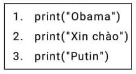

Kết quả khi chạy:

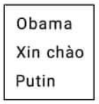

Tuy nhiên trong quá trình xuất dữ liệu ra màn hình, đôi khi chúng ta muốn các thoogn tin hiển thị trên cùng 1 dòng dữ liệu. Python có hỗ trợ điều này, bằng cách thêm đối số end vào trong hàm print (xem chương trình sau).

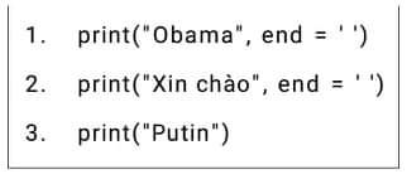

đối số end = '' tức là khoảng cách ra 1 khoảng trắng rồi tới chuỗi tiếp theo.

Copy từ nguồn

https://duythanhcse.wordpress.com/2016/12/11/bai-09-cach-xuat-du-lieu-voi-ham-print-trong-python/

Ta có thể áp dụng để xuất thông báo mời người dùng nhập dữ liệu từ bàn phím như chương trình sau.

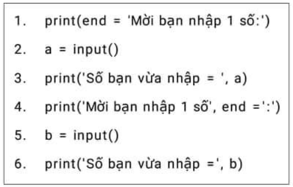

Ở trên các bạn thấy để end đằng trước hay end đằng sau, bạn dùng cách nào cũng được.

## II. INPUT DỮ LIỆU

Trong mọi hệ thống đều cần có sự tương tác trao đổi dữ liệu với bên ngoài. Sự tương tác đó thông qua các hệ thống Input. Ouput như hình dưới đây. Chúng ta đã được làm quen với một lệnh Output đầu tiên của Python là lệnh print(). Bây giờ chúng ta sẽ làm quen với lệnh input().

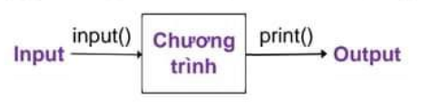

Hàm input() dùng để thực hiện việc nhập dữ liệu từ bàn phím, dữ liệu được nhập chính là giá trị của hàm số này. Hàm input() có cú pháp như sau:

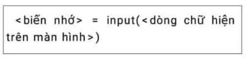

Khi thực hiện lệnh \<dòng chữ hiện trên màn hình> sẽ xuất hiện, người dùng nhập một xâu kí tự bất kỳ, kết thúc bằng bấm ENTER. Kết quả của hàm sẽ được lưu vào \<biến nhớ>.

Xét ví dụ đơn giản sau.

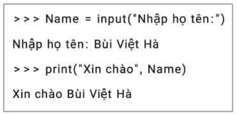

Chú ý rằng hàm input() luôn trả lại dữ liệu kiểu xâu ký tự, mặc dù trên màn hình dữ liệu thể hiện như số bình thường.

Trong ví dụ sau dữ liệu nhập từ bàn phím vào biến nhớ num là 30, cụ thể num sẽ là xâu "30" chứ không phải là số 30.

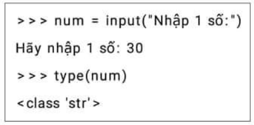

## III. CHUYỂN ĐỔI TRỰC TIẾP DỮ LIỆU

### 1. Hàm int()

Hàm int() có cú pháp là:

> \<giá trị trả về> = int(\<giá trị>)

Hàm này sẽ trả lại giá trị là số nguyên là chuyển đổi của tham số \<giá trị>. Hàm sẽ chỉ có tác dụng khi \<giá trị> là một só thực hoặc xâu kí tự của một số nguyên. Nếu đổi số là số thực thì hàm int() sẽ lấy ra phần nguyên của số này.

Ví dụ: int(2.56) = 2, int(-15.09) = -15

Chú ý đến các câu lệnh 3,4 trong ví dụ sau để thấy hàm int() không thể chuyển dổi xâu gốc là số thực hay biết thức số.

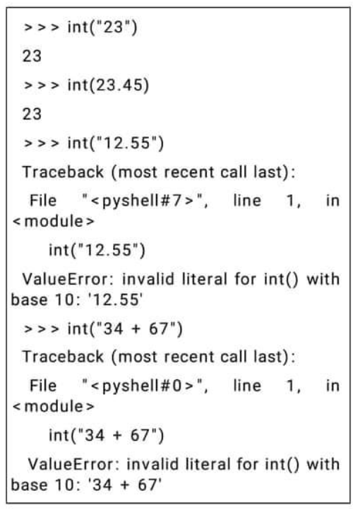

### 2. Hàm float()

Hàm float() có cú pháp là:

\<giá trị trả về> = float(\<giá trị>) 

Hàm này sẽ trả lại giá trị là số thực là chuyển đổi của tham biến \<giá trị>. Hàm sẽ chỉ có tác dụng khi \<giá trị> là một biểu thức số bất kỳ hoặc là xâu ký tự của một số thực hoặc số nguyên.

Chú ý: Hàm sẽ báo lỗi khi \<giá trị> là một xâu chứa biểu thức số bất kỳ

Trong ví dụ sau, hãy chú ý đến lệnh chuyển đổi cuối cùng bị lỗi do hàm float() không chuyển đổi được xâu ký tự của một biểu thức.

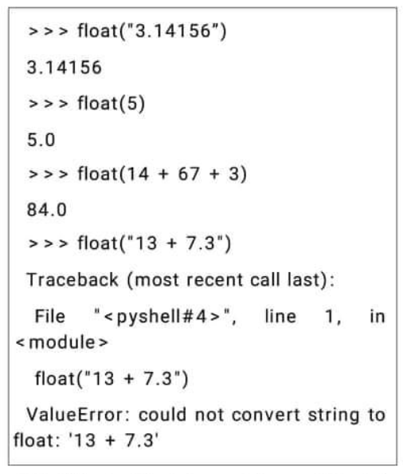

Để xử lý xâu biểu thức xem hàm eval() ở phần sau.

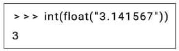

Muốn chuyển đổi một xâu của số thực chúng ta sẽ cần sử dụng 2 hàm int() và float() lồng nhau như ví dụ sau.

### 3. Hàm str()

Hàm str() có chức năng chuyển đổi một giá trị hoặc một biểu thức số sang kiểu xâu ký tự. Cú pháo tương tự như 2 hàm int() và float() đã biết.

\<giá trị trả về> = str(\<biểu thức>)

Hàm này sẽ chuyển đổi một biểu thức số bất kỳ sang dạng xâu. Nếu \<biểu thức> đã là xâu rồi thì hàm sẽ trả lại giá trị gốc cỉa xâu này. Chú ý rằng \<biểu thức> có thể phức tạp bất kỳ. Xét một số ví dụ sau.

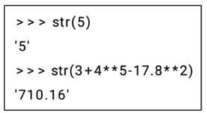

### 4. Một số ví dụ

Ví dụ 1: Chương trình nhập lần lượt 2 số tự nhiên m,n từ bàn phím.

Nhap hai so tu nhien.py

```python
# Nhập lần lượt 2 số m, n từ bàn phím.

m = int(input("Nhập số m: "))
n = int(input("Nhập số n: "))

print("2 số m, n đã nhập là m =", m, "n =", n)
```

Khi thực hiện chương trình này, kết quả thể hiện trên màn hình tương tác sẽ như sau.

```
Nhập số m: 11
Nhập số n: 8
2 số m, n đã nhập là m = 11 n = 8
```

Ví dụ 2: Chương trình yêu cầu nhập tên, sau đó là tuổi của người sử dụng.

Nhap ten va tuoi.py

```python
# Nhập lần lượt tên và tuổi của người dùng.
name = intput ("Nhập họ tên của bạn: ")
n = int(input("Xin chào bạn " + name + "Bạn năm nay bao nhiêu tuổi: "))
print("Chúc mừng bạn đã nhập xong dữ liệu.")
```

### 5. HÀM EVAL() TÍNH TOÁN GIÁ TRỊ TỪ XÂU BIỂU THỨC

Chúng ta đã biết được ý nghĩa của 3 hàm số int(), float() và str() dùng để chuyển đổi trực tiếp các kiểu dữ liệu cơ bản, được dùng nhiều trong quá trình nhập liệu bằng lệnh input(). Tuy nhiên còn một khó khăn nữa mà các lệnh trên không thể chuyển đổi được khi làm việc với các xâu ký tự là biết thức toán học. Ví dụ các xâu như "12 + 5" hay "23 ** 2 - 12" sẽ không thể hiểu được bởi hàm int() hoặc float()

Hàm số eval() chính là hàm chúng ta cần trong cá trường hợp này.

Cú pháo của hàm eval().

> \<giá trị trả về> = eval("<biểu thức>")

Hàm số ngyaf có tác dụng tính toán các biểu thức bên trong một xâu ký tự và chuyển đổi chúng về dạng số tương ứng.

Xét một vài ví dụ ban đầu.

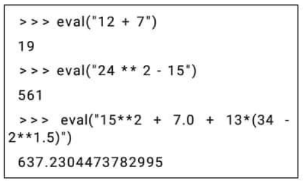

Ví dụ chương trình sau yêu cầu người dùng nhập một biểu thức toán học từ bàn phím, sau khi nhập, chương trình sẽ tính toán và đưa ra ngay kết quả.

Nhap bieu thuc.py

```python
# Nhập biểu thức từ bàn phím
x = eval(input("nhập biểu thức toán học bất kỳ: "))
print("Giá trị biểu thức đã nhập là:",x)
```

Kết quả của chườn trình trên có thể như sau:
```
Nhập biểu thức toán học bất kỳ: 2**2**3 + 320
Giá trị biểu thức đã nhập là: 576
```

Một tính năng rất đặc biệt nữa là hàm eval() có thể nhận biết đồng thời nhiều biểu thức trên một hàng, cacsah nhau bởi dấu phẩy.

Ví dụ.

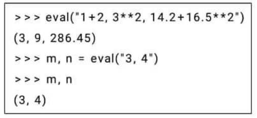

Tính năng này của hàm eval() có rất nhiều ứng dụng trên thực tế.

Ví dụ: Nhập nhiều số tự nhiên trên một dòng từ bàn phím.

Nhap 3 so.py

```python
# Nhập 2 hoặc nhiều số trên một hàng.
m, n, p = eval(input("Nhập các số m,n,p (cách nhau bởi dấu phẩy): "))
print("Các số đã nhập là:", m, n, p)
```

BÀI TẬP TỰ LUẬN

Bài 1. Các biểu thức sau sẽ có giá trị đúng hay sai?

a) 1 < 2 == 3 < 4

b) 4 < 4 - 1

c) False == False 

d) True == True

Bài 2. Giả sử thực hiện dòng lệnh sau trên Python:

> x = input("Enter x: ")

Khi thực hiện người dùng sẽ nhập từ dòng yêu cầu nhập như sau: 3 + 4*5

Hỏi giá trị x khi đó là gì?

a) 3 + 4 * 5 

b) 23

c) "3 + 4 * 5"

Bài 3. Giả sử em thực hiện các lệnh từ cửa sổ tương tác của Python, sau đó nhập dữ liệu tại chỗ:

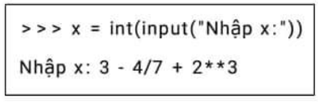

Kết quả sau các lệnh trên x nhận giá trị nào?

a) 10

b) 11

c) Python thông báo lỗi

Bài 4. Giả sử em thực hiện các lệnh sau từ cửa sổ tương tác của python, sau đó nhập dữ liệu tại chỗ:

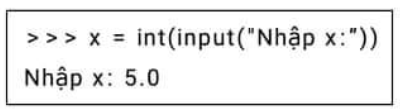

Kết quả sau các lệnh trên x nhận giá trị nào?

a) 5 

b) 5.0

c) '5'

d) Python thông báo lỗi.

Bài 5. giả sử em thực hiện các lệnh sau từ của sổ tương tác của Python, sau đó nhập dữ liệu tại chỗ:

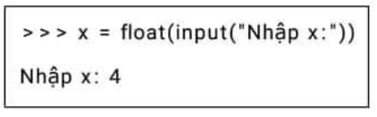

Kết quả sau các lệnh trên x nhận giá trị nào?

a) 4

b) 4.0

c) '4.0'

d) Python thông báo lỗi.

Bài 6. Mệnh đề sau đúng hay sai:

Hàm eval() Chấp nhận trong tham số của mình tất cả các biểu thức sau:

"2 + 2**5","3 + 4/3,5 ** 2","3.456 + 2.890".

Bài 7. Lệnh 

```python
print(13 + 25)
```

Sẽ in ra kết quả là gì ?

a) 13 + 25

b) "13 + 25"

c) 38

d) "38"

Bài 8. Kết quả của lệnh, Biểu thức print(1 - 4 % 6) như thế nào?

a) 1 - 4 % 6

b) -3

c) 3

Bài 9. Viết chương trình nhập 2 số tự nhiên m,n trên một dòng cách nhau bởi dấu phẩy, sau đó hiện thị tổng và tích 2 số này.

BÀI TẬP VÀ THỰC HÀNH

Bài 1. a) Gõ chương trình sau

```
from math import sqrt

print("Nhập a,b,c khác 0:")

a = float(input())
b = float(input())
c = float(input())

d = b**2 - 4*a*c

x1 = (-b - sqrt(d))/(2*a)
x2 = -b/a - x1

print("x1 = ", x1)
print("x2 = ", x2)

input()
```

b) Chọn lệnh File --> Save và lưu chương trình tên PTB2 lên đĩa.

c) Chọn lệnh Run --> Debug để dịch và sử lỗi (nếu có).

d) Chọn lệnh Run --> Run để thực hiện chương trình. Nhập các giá trị 1; -3 và 2 (nhập 1, nhấn Enter, Nhập -3, Nhấn Enter, Nhập 2, Enter). Quan sát kết quả hiện thị trên màn hình (x1 = 1.0 x2 = 2.0).

e) chọn lệnh Run --> Run rồi nhập giá trị 1; 0; -2

Quan sát kết quả hiện thị trên màn hình (x1 = -1.41 x2 = 1.41)

f) Chỉnh sửa chương trình trên để có chương trình không dùng biến trung gian D

Thực hiện chương tình đã sửa với bộ dữ liệu 1; -5; 6. Quan sát kết quả trên màn hình (x1 = 2.0 x2 = 3.0).

i) Thực hiện chương trình với bộ dữ liệu 1; 1; 1 và quan sát kết quả trên màn hình.

Bài 2. Một cửa hàng cung cấp dịch vụ bán hàng thanh toán tại nhà. Khách hàng chỉ cần đăng kí số lượng mặt hàng cần mua, nhân viên của hàng sẽ giao hàng và nhận tiền thanh toán tại nhà khách hàng. Ngoài trị giá hàng hóa, khách hàng còn phải trả thêm phí dịch vụ. Viết chương trình Python để tính tiền thanh toán trong trường hợp khách hàng chỉ mua một mặt hàng duy nhất.

Gợi ý: Côn thức cần tính:

Tiền thanh toán = Đơn giá x Số lượng + Phí dịch vụ

```python
phi = 10000

dongia = input('Nhập đơn giá = ')

soluong = input('Nhập số lượng = ')

thanhtien = soluong * dongia + phi

print('Tổng số tiền phải trả', thanhtien)
```

a) Gõ chương trình sau và tìm hiểu ý nghĩa của từng câu lệnh trong chương trình.

b) Dịch và chỉnh sửa các lỗi gõ, nếu có.

c) Chạy chương trình với các bộ dữ liệu (đơn giá và số lượng) như sau (1000,20), (3500,200), (18500,123). Kiểm tra tính đúng của các kết quả in ra.

# CHỦ ĐỀ 3: CÂU LỆNH RẼ NHÁNH
## I. RẼ NHÁNH

Thường ngày, có nhiều việc chỉ được thực hiện khi một điều kiện cụ thể nào đó được thỏa mãn.

Ví dụ, Châu và Ngọc thường cùng nhau chuẩn bị các bài thực hành môn Tin học.

Một lần Châu hẹn với Ngọc: "Chiều mai nếu trời không mưa thì Châu sẽ đến nhà Ngọc".

Một lần khác, Ngọc nói với Châu: "Chiều mai nếu trời không mưa thì Ngọc sẽ đến nhà Châu, nếu mưa thì sẽ gọi điện cho Châu để trao đổi".

Câu nói của Châu cho ta biết một việc làm cụ thể (Châu đến nhà Ngọc) sẽ được thực hiện nếu một điều kiện cụ thể (trời không mưa) thỏa mãn. Ngoài ra không đề cập đến việc gì sẽ xảy ra nếu điều kiện đó không thỏa mãn (trời mưa).

Ta nói cách diễn đạt như vậy thuộc dạng thiếu:

Nếu... thì...

Câu nói của Ngọc khẳng định một trong hai việc cụ thể (Ngọc đến nhà Châu hay Ngọc gọi điện cho Châu) chắc chắn sẽ xảy ra. Tuy nhiên, việc nào trong hai việc sẽ được thực hiện thì tùy thuộc vào điều kiện cụ thể (trời không mưa) thỏa mãn hay không.

Ta nói cách diễn đạt như vậy thuộc dạng đủ:

Nếu... thì..., nếu không thì...

Từ đó có thể thấy, trong nhiều thuật toán, các thao tác tiếp theo sẽ phụ thuộc vào kết quả nhận được từ các bước trước đó.

Cấu trúc dùng để mô tả các mệnh đề có dạng như trên được gọi là cấu trúc rẽ nhánh thiếu và đủ.

Ví dụ, để giải phương trình bậc hai:

ax² + bx + c = 0, (a ≠ 0)

trước tiên, ta tính biệt số delta D = b² - 4ac.

Nếu D không âm, ta sẽ đưa ra các nghiệm. Trong trường hợp ngược lại, ta phải thông báo là phương trình vô nghiệm.

Như vậy, sau khi tính D, tùy thuộc vào giá trị của D, một trong hai thao tác sẽ được thực hiện.

Mọi ngôn ngữ lập trình đều có các câu lệnh để mô tả cấu trúc rẽ nhánh.

## II. CÂU LỆNH IF

Để mô tả cấu trúc rẽ nhánh, Python dùng câu lệnh if. Tương ứng với hai dạng thiểu và đủ nói ở trên, Python có hai dạng câu lệnh if:

a) Dạng thiếu

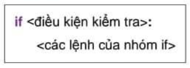

Chú ý sau <điều kiện> cần có dấu ":"

Toàn bộ cụm các lệnh của nhóm if phải viết thụt vào (tối thiểu một dấu cách) so với if.

Chú ý: tất cả các lệnh trong nhóm if này đều phải thụt vào như nhau. Điều này rất quan trọng.

Lệnh trên sẽ thực hiện như sau:

Chương trình sẽ kiểm tra <điều kiện> sau từ khóa if, nếu điều kiện là đúng thì nhóm \<các lệnh của nhóm if> sẽ thực hiện. Nếu điều kiện sai thì lệnh sẽ được bỏ qua.

b) Dạng đủ

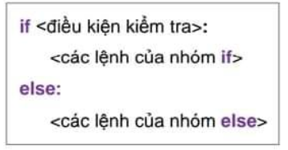

Chú ý sau <điều kiện> của if và else cần có dấu ":"

Toàn bộ cụm \<các lệnh của nhóm if> và \<các lệnh của nhóm else> phải viết thụt vào (tối thiểu một dáu cách) so với if và else.

Chú ý: Tất cả cá lệnh trong nhóm if và else này đều phải thụt vào như nhau. Điều này rất quan trọng.

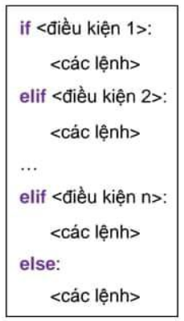

Lệnh trên sẽ thực hiện như sau:

Chương trình sẽ kiểm tra <điều kiện> sau từ khóa if, nếu điều kiện đúng thì nhóm \<các lệnh> của nhóm if sẽ thực hiện. Nếu điều kiện sai thì \<các lệnh> của nhóm else sẽ được thực hiện.

c) Lệnh if...elif...else trong Python

elif là viết gọn của else if, nó cho phép chúng ta kiểm tra nhiều điều kiện. Nếu điều kiện là sai, nó sẽ kiểm tra điều kiện của khối elif tiếp theo và cứ như vậy cho đến hết.

Nếu tất cả các điều kiện đều sai nó sẽ thực thi khối lệnh của else. Chỉ một khối lệnh trong if...elif...else được thực hiện theo điều kiện. Có thể không có hoặc có nhiều elif, phần else là tùy chọn.

Ví dụ 1

```python
if delta < 0:
    print("Phương trình vô nghiệm")
```

Ví dụ 2

```python
if (a % 3) == 0:
    print("a chia hết cho 3")
else:
    print("a không chia hết cho 3")
```

Ví dụ 3. Để tìm số lớn nhất mã tỏng hai số a và b, có thể thực hiện bằng hai cách sau:

- Dùng câu lệnh gán max = a và lệnh if dạng thiếu:

```python
if b > a: max = b
```

- Dùng một lệnh if đạng đủ:
```python
if b > a: max = b
else: max = a
```

BÀI TẬP THỰC HÀNH

Bài 1. Viết chương tình nhập hai số nguyên a và b khác nhau từ bàn phím và in hai số đó ra màn hình theo thứ tự không giảm.

a) Gõ chương trình sau đây:

```python
A, B = eval(input("Nhập A, B:"))

if A < B:
    print(A, " < ", B)
else:
    print(B, " < ", A)
```

b) Tìm hiểu ý nghĩa của các câu lệnh trong chương trình. Chạy chương trình với các bộ dữ liệu (12, 53), (65, 20) để thử chương trình.

```python
Long = int(input("Nhập ch.cao Long"))
Trang = int(input("Nhập ch.cao Trang"))

if Long > Trang:
    print("Bạn Long cao hơn")

if Long < Trang:
    print("Bạn Trang cao hơn")
else:
    print("Hai bạn cao bằng nhau")
```

Bài 2. Viết chương trình nhập chiều cao của hai bạn Long và Trang, in ra màn hình kết quả so sánh chiều cao của hai bạn, chẳng hạn "Bạn Long cao hơn".

a) Gõ chương trình sau đây:

```python
if Long > Trang:
    print("Bạn Long cao hơn")
elif Long < Trang:
    print("Bạn Trang cao hơn")
else:
    print("Hai bạn cao bằng nhau")
```

b) Chạy chương trình với các bộ dữ liệu (1.5, 1.6) và (1.6, 1.5) và (1.6, 1.6). Quan sát các kết quả nhận được và nhận xét. Hãy tìm chỗ chưa đúng trong chương trình.

d) Sửa lại chương trình để có kết quả đúng: chỉ in ra màn hình một thông báo kết quả.

Tham khảo và tìm hiểu ý nghĩa của đoạn chương trình sau đây:

Bài 3.Dưới đây là chương trình nhập ba số dương a, b và c từ bàn phím, kiểm tra và in ra màn hình kết quả kiểm tra ba số đó có thể là độ dài các cạnh của một tam giác hay không.

```python
a, b, c = eval(input("Nhập ba cạnh: "))

if a + b > c and b + c > a and c + a > b:
    print("a, b, c là 3 cạnh của 1 tam giác")
else:
    print("Không là 3 cạnh của 1 tam giác")
```

Ý tưởng: Ba số dương a, b và c là độ dài các cạnh của một tam giác khi và chỉ khi a + b > c, b + c > a và c + a > b.

Tìm hiểu ý nghĩa của các câu lệnh trong chương trình, soạn, dịch và chạy chương trình với các số tùy ý.

BÀI TẬP TỰ LUẬN

Bài 1. Các câu lệnh Python sau đây được viết đúng hay sai? Hãy sửa lại cho đúng.

```python
# a)
if x = 7: 
    a = = b
```
```python
# b)
if x > 5: 
    a = b.
```

```python
# c)
if x > 5:
    a = b
else:
    m = n.
```

``` python
# d)
if x > 5:
    a = b
    m = n
```

Bài 2. Cho x = 5, với mỗi câu lệnh sau, khi thực hiện xong giá trị của x là bao nhiêu?

```python
# a)
if 45 % 3 == 0:
    x += 1
```

```python
# b)
if x > 10:
    x += 1
```
Bài 3. Viết chương trình nhập vào một số nguyên dương, in ra thông báo số đó là số chẵn hay số lẻ.

# CHỦ ĐỀ 4: CẤU TRÚC LẶP

## I.LẶP

Với a là số nguyên a > 2, xét các bài toán sau đây:

Bài toán 1. Tính và đưa ra kết quả ra màn hình tổng

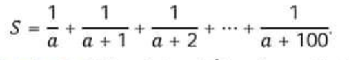

Bài toán 2. Tính và đưa kết quả ra màn hình tổng 

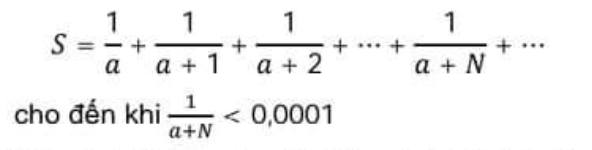

Với cả hai bài toán, để thấy cách để tính tổng S có nhiều điểm tương tự:

- Xuất phát, S được gán giá trị 1/a.

- Tiếp theo, cộng vào tổng S một giá trị 1/(a+N) với N = 1,2,3,4,5,.... Việc cộng này được lặp lại một số lần.

Đối với bài toán 1, số lần lặp là 100 và việc cộng vào tổng S sẽ kết thúc khi đã thực hiện việc cộng 100 lần.

Đối với bài toán 2, số lần lặp chưa biết trước nhưng việc cộng vào tổng S sẽ kết thúc khi điều kiện 1/(a+N) < 0.0001 được thỏa mãn.

Nói chung, trong một số thuật toán có những thao tác phải thực hiện lặp đi lặp lại một số lần. Một trong các đặc trưng của máy tính là có khả năng thực hiện hiệu quả các thao tác lặp. Cấu trúc lặp mô tả thao tác lặp và có hai dạng là lặp với số lần biết trước và lặp với số lần chưa biết trước.

Các ngôn ngữ lập trình đều có các câu lệnh để mô tả cấu trúc lặp.

## II. LẶP VỚI Ố LẦN BIẾT TRƯỚC

### 1. Hàm range

Cú pháp tổng quát của hàm này như sau:

range([\<start> = 0],\<stop>,[\<khoảng cách> = 1])

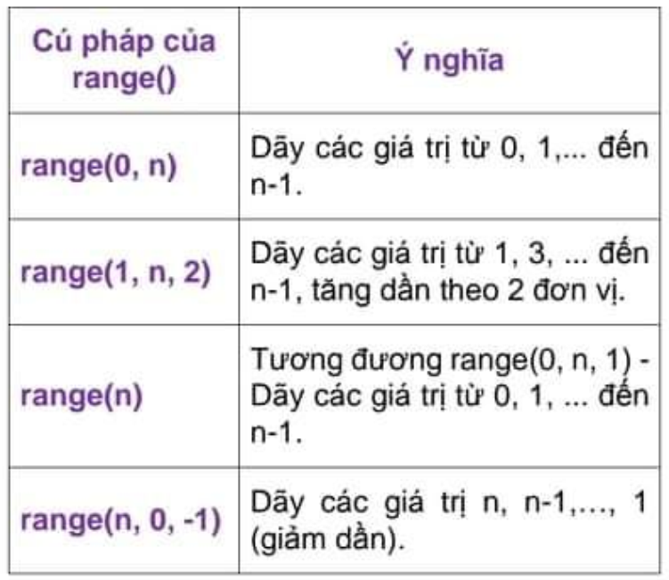

### 2. Lệnh lặp for

_Dạng lặp tiến_

_Cách viết_

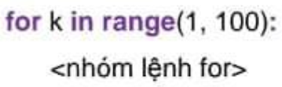

_Mô tả ý nghĩa_

Lần lượt cho biến nhớ k gán các giá trị tăng từ 1 đến 99, mỗi lần như vậy thực hiện lặp \<nhóm lệnh for>

_Dạng lặp lùi_

_Cách viết_

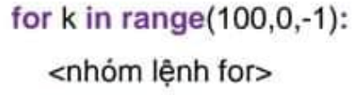

_Mô tả ý nghĩa_

Lần lượt cho biến nhớ k gán các giá trị giảm từ 100 xuống đến 1, mỗi lần như vậy thực hiện lặp \<nhóm lệnh for>

Sau đây là chương trình giải bài toán 1 ở trên

```python
# ví dụ Bài toán 1
a = int(input("Nhập a: "))
s = 0
for i in range(1,101):
    s+= 1/(a + i)
print(s)
```

Ví dụ 2. Chương trình sau thực hiện việc nhập từ bàn phím hai số nguyên dương M và N (M < N), tính và đưa ra màn hình tổng các số chia hết cho 3 hoặc 5 trong phạm vi từ M đến N.

```python
m = int(input("Nhập M: "))
n = int(input("Nhập N: "))
mn = range(m,n+1)
s = 0

for i in mn:
    if((i % 3 == 0) or (i % 5 == 0)):
        s += i
print(s)
```

Ví dụ 3. Cho trước số tự nhiên n, cần tính tổng S = 1 + 2 + ... + n.

```python
n,S = 100,0
for k in range(1,n+1):
    S = S + k
print("Tổng ", N, " số tự nhiên đầu tiên:",S)
```

Ví dụ 4. Chương trình sau yêu cầu nhập từ bàn phím số tự nhiên n, sau đó sẽ tính các ước số thực của n (ước số thực sự của số n là các ươc scuar n và nhỏ hơn n).

```python
n = int(input("Nhập số tự nhiên n: "))
count = 0
for k in range(1,n):
    if n % k == 0:
        count += 1
print("Số ước số thực sự của", n, ":", count)
```

### III. LẶP VỚI SỐ LẦN CHƯA BIẾT TRƯỚC VÀ CÂU LỆNH WHILE-DO

Một lệnh nữa cần đưa ra ở đầu là lệnh lặp theo điều kiện while. Khác với lệnh for là lặp theo số lần lặp cố định, lệnh while có số vòng lặp không cố định mà phụ thuộc vào điều kiện dừng của lệnh.

Cú pháp đơn giản như sau.

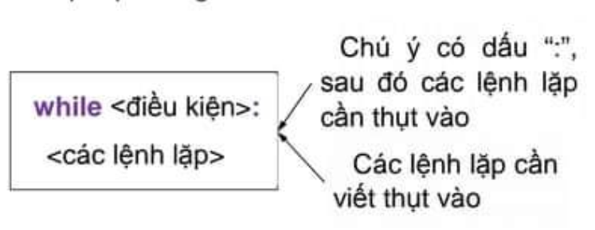

Lệnh này sẽ chạy liên tục \<các lệnh lặp> trong thân của while và chỉ dừng theo <điều kiện>. Mỗi lần chạy \<các lệnh lặp>, chương trình sẽ kiểm tra <điều kiện>, nếu đúng thì chạy tiếp, nếu sai thì dừng lại, kết thúc lệnh.

Việc thực hiện lệnh while được thể hiện trên sơ đồ ở hình 1.

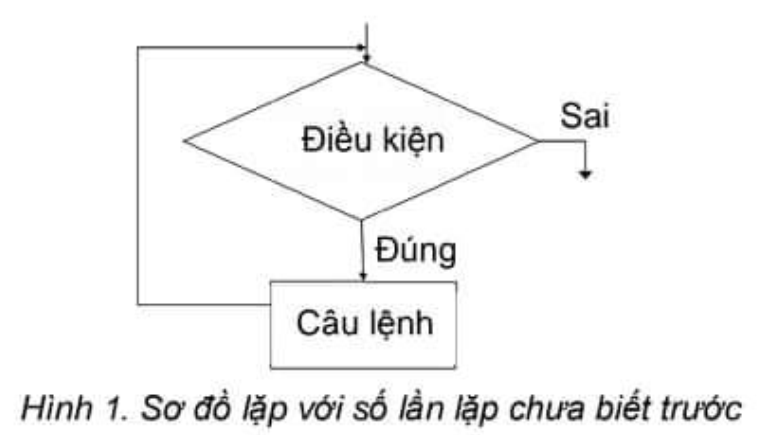

Sau đây là chương trình giải bài toán 2.

```python
a = int(input("Nhập a: "))
s = 1/a
n = 0
while not (1/(a+n) < 0.0001):
    n += 1
    s += 1/(a+n)
print("Tổng = ",s) 
```
Ví dụ 2. Tìm ước chung lớn nhất (ƯCLN) của hai số nguyên dương M và N

Thuật toán 

Bước 1. Nhập M,N

Bước 2. Nếu M = N thì lấy giá trị chung này làm ƯCLN rồi chuyển đến bước 5;

Bước 3. Nếu M > N thì M <-- M - N ngược lại N <-- N - M.

Bước 4. Quay lại bước 2;

Bước 5. Đưa ra ƯCLN rồi kết thúc.

Chương tình sau giải bài toán tìm ước chung lớn nhất.

```python
M = int(input("Nhập số tự nhiên m:"))
N = int(input("Nhập số tự nhiên n:"))

m, n = M, N

while n != m:
    if n > m:
        n = n - m
    else:
        m = m - n

print("USCLN của", M, "và", N, "là:", n)
```

Chú ý:

- Trong lệnh lặp while, <điều kiện> sẽ được kiểm tra trước khi thực hiện các lệnh trong vòng lặp. Do đó nếu <điều kiện> bị sai ngay từ đầu thì sẽ không có lệnh nào được thực hiện.

- Các câu lệnh trong vòng lặp thường được lặp lại nhiều lần, vì vậy để tăng hiệu quả của chương trình thì những thao tác không cần lặp lại nên đưa ra ngoài vòng lặp.

_Lặp vô hạn lần - Lỗi lập trình cần tránh_

Khi viết chương trình sử dụng cấu trúc lặp cần chú ý trành tạo nên vòng lặp không bao giờ kết thúc. Chẳng hạn, chương trình sau đây sẽ lặp lại vô tận:

```python
a = 5
while a < 6:
    print('A')
```

Trong chương trình trên, giá trị của biến a luôn bằng 5, điều kiện a < 6 luôn luôn đúng nên lệnh print('A') luôn được thực hiện.

Do vậy, khi htujwc hiện vòng lặp, giá trị của biến trong điều kiện của câu lệnh phải được thay đổi sớm hay muộn giá trị của điều kiện được chuyển từ đúng sang sai. Chỉ như thế chương trình mởi không "rơi" vào những "vòng lặp vô tận".

BÀI TẬP TỰ LUẬN

1.Có thể dùng câu lệnh while để thay cho câu lệnh for được không? Nếu được, hãy thực hiện điều đó với chương trình giải Bài toán 1.

2.Hãy phát biểu sự khác biệt giữa câu lệnh lặp với số lần lặp cho trước và câu lệnh lặp với số lần lặp chưa biết trước.

3.Sau khi thực hiện đoạn chương trình sau, giá trị của biến j bằng bao nhiêu?

```python
j = 0
for i in range(0,6):
    j += 2
```

4.Các câu lệnh Python sau đây có hợp lệ không, vì sao?

a)

```python
for i in range(100,1):
    print('A')
```

b)

```python
for i in range(1.5, 10.5):
    print('A')
```

c)

```python
for i in range[1,10]:
    print('A')
```

d)

```python
for i in range(1; 10)
    print('A')
```

5.Hãy tìm hiểu mỗi đoạn chương trình Python sau đây và cho biết với đoạn lệnh đó chương trình thực hiện bao nhiêu vòng lặp. Hãy rút ra nhận xét của em.

a)

```python
S = n = 0

while S <= 10:
    n += 1
    S += n
```

b)

```python
S = n = 0

while S < 10:
    n += 1
    S += n
```

6.Viết chương trình nhập từ bàn phím tuổi của cha và con (hiện tại tuổi cha lớn hơn hai lần tuổi con và tuổi cha hơn tuổi con ít nhất là 25). Đưa ra màn hình câu trả lời cho câu hỏi "Bao nhiêu năm nữa thì tuổi cha gấp đôi tuổi con?"

7.Viết chương trình nhập số tự nhiên n và in ra tất cả các ước số thực sự của n.

8.Viết chương trình nhập số tự nhiên n và đếm các ước số thực sự của n. In kết quả ra màn hình.

9.Viết các chương trình nhập số tự nhiên n và tính các giá trị sau:

a) Tính tổng 1 + 2 + .... + 2n.

b) Tính tổng các số tự nhiên < n và là số lẻ.

c) Tính tổng các số tự nhiên < n và là số chẵn.

10.Viết các chương trình nhập một số tự nhiên n và tính các giá trị sau:

a) Tính số các ước số nguyên tố khác nhau của n (tính cả n).

b) Tính tổng các ước số thực sự của n (không tính n).

c) Tính tổng 1² + 2² + 3² + .... + n².

11.Viết chương trình nhập số tự nhiên n từ bàn phím. Tính và kiểm tra tính đúng đắn của biểu thức sau:

1² + 2² + 3² + .... + n² = n(n + 1)(2n + 1) / 6

12. Viết chương trình nhập số tự nhiên n từ bàn phím. Tính và kiểm tra tính đúng đắn của biểu thức sau:

1³ + 2³ + 3³ + .... + n³ = (1 + 2 + 3 + .... + n)²

13. Số tự nhiên được gọi là hoàn hảo nếu số đó bằng tổng các ước số thực sự của mình. Ví dụ số 6 là số hoàn hảo vì 6 = 1 + 2 + 3. Viết chương trình nhập số tự nhiên n từ bàn phím và kiểm tra xem n có phải là số hoàn hảo hay không. Thông báo trên màn hình.

BÀI TẬP THỰC HÀNH

Bài 1.

a) Hãy gõ chương trình ở ví dụ 3 mục II và thực hiện với cá giá trị N = 3, 4, 5,... để kiển tra kết quả tính tổng của N số tự nhiên đầu tiên.

b) Hãy thay đoạn chương trình 1 bằng đoạn chương trình 2.

```python
for k in range(1, N+1):
    S = S + k
print("Tổng",N,"Số tự nhiên đầu tiên:",S)
```
> Chương trình 1

```python
for k in range(1, N+1):
    if k % 2 == 0:
        S = S + k
print("Tổng các số chẵn <=",N,":",S)
```
> Chương trình 2

Cho biết kết quả thực hiện chương trình với N = 8, 9, 10 là gì?

Bài 2. Viết chương trình in ra màn hình bảng nhân của một số từ 1 đến 9, số được nhập từ bàn phím.

a) Gõ chương trình sau đây:

```python
N = int(input("Nhập số N ="))
for i in range(1,11):
    print(N,'x',i,'=',N*i)
```

b) Tìm hiểu ý nghĩa của các câu lệnh trong chương trình, dịch chương tình và sửa lỗi, nếu có.

c) Chạy chương trình với các giá trị nhập vào lần lượt là 1, 2,..., 10. Quan sát kết quả nhận được trên màn hình.

Bài 3. Viết chương trình sử dụng lệnh lặp while để tính trung bình n số thực x₁, x₂, x₃, ..., xₙ.

Các số n và x₁, x₂, x₃, ..., xₙ được nhập vào từ bàn phím.

Ý tưởng: sử dụng một biến đếm và lệnh lặp while để nhập và cộng dần các số vào một biến kiểu số thực cho đến khi nhập đủ n số.

a) Gõ chương trình sau đây:


```python
dem = TB = 0

n = int(input("Nhập số các số cần tính"))

while dem < n:
    dem += 1
    x = int(input("Nhập số: "))
    TB += x

TB /= n

print("Trung bình của ", n, " số là:", TB)
```

b)Đọc và tìm hiểu ý nghĩa của từng câu lệnh. Dịch chương trình và sửa lỗi, nếu có. Chạy chương trình với các bộ dữ liệu được gõ từ bàn phím và kiểm tra kết quả nhận được.

c)Viết lại chương trình bằng cách dùng câu lệnh `for` thay cho câu lệnh `while`.

```python
n = int(input("Nhập một số tự nhiên"))

if n <= 1:
    print(n, "không là số nguyên tố")
else:
    i = 2

    while (n % i != 0):
        i += 1

    if i == n:
        print(n, "là số nguyên tố")
    else:
        print(n, "không là số nguyên tố")
```

Bài 4. Tìm hiểu chương trình nhận biết một số tự nhiên N được nhập vào từ bàn phím có phải là số nguyên tố hay không.

Ý tưởng: Kiểm tra lần lượt N có chia hết cho các số tự nhiên 2 ≤ i ≤ N - 1 hay không. Kiểm tra tính chia hết bằng phép chia lấy phần dư (%).

a) Đọc và tìm hiểu ý nghĩa của từng câu lệnh trong chương trình sau đây.

b) Gõ, dịch và chạy thử chương trình với các số khác nhau.

# CHỦ ĐỀ 5 HÀM SỐ

## I. KHÁI NIỆM HÀM SỐ

Các chương trình giải các bài toán phức tạp thường rất dài, có thể gồm hàng trăm, hàng nghìn lệnh. Khi đọc những chương trình dài, rất khó nhận biết được chương trình thực hiện các công việc gì và việc hiệu chỉnh chương trình cũng khó khăn. Vì vậy, vấn đề đặt ra là phải cấu trúc chương trình như thế nào để cho chương trình dễ đọc, dễ hiệu chỉnh, dễ nâng cấp.

Mặt khác, việc giải quyết một bài toán phức tạp thường đòi hỏi nói và nói chung có thể phân thành các bài toán con.

Xét bài toán tính tổng bốn lũy thừa:

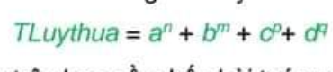

Bài toán trên bao gồm bốn bài toán con tính aⁿ, bᵐ, cᵖ, dᑫ có thể giao cho bốn người, mỗi người thực hiện một bài. Giá trị TLuythua là tổng kết quả của bốn bài toán con đó. Với những bài toán phức tạp hơn, mỗi bài toán con lại có thể được phân chia thành các bài toán con nhỏ hơn. Quá trình phân rã làm “mịn” dần bài toán như vậy được gọi là cách thiết kế từ trên xuống.

Tương tự, khi lập trình để giải bài toán trên máy tính có thể phân chia chương trình (gọi là chương trình chính) thành các khối (môđun), mỗi khối bao gồm các lệnh giải một `hàm số`. Sau đó, chương trình chính sẽ được xây dựng từ cá hàm số khác.

Cách lập trình như vậy dựa trên phương pháp lập trình có cấu trúc và chương trình được xây dựng gọi là chương trình có cấu trúc.

_Hàm số là một dãy lệnh mô ta một số thao tác nhất đinh và có thể được thực hiện (được gọi) từ nhiều vị trí trong chương trình._

Ví dụ, chương trình nhập dữ liệu từ bàn phím, tính và đưa ra màn hình giá trị `TLuythua` được mô tả như trên có thể viết bằng Python như sau:

print("Nhập a, b, c, d, m, n, p, q")

a, b, c, d, m, n, p, q = eval(input())

```python
Luythua1 = 1
for i in range(1, n+1):
    Luythua *= a
```

```python
Luythua2 = 1
for i in range(1, m+1):
    Luythua2 *= b
```

```python
Luythua3 = 1
for i in range(1, p+1):
    luythua3 *= c
```

```python
Luythua4 = 1
for i in range(1, q+1):
    Luythua4 *= d
```

Trong chương trình trên có bốn đoạn lệnh tương tự nhau, việc lặp lại những đoạn lệnh tương tự nhau làm cho chương trình vừa dài vừa khó theo dõi. Để nâng cao hiểu quả lập trình, các ngôn ngữ lập tình bậc cao đề cung cấp khả nang xây dựng hàm số dạng tổng quát "đại diện" chi nhiều đoạn lệnh tương tự nhau, chẳng hạn tính lũy thừa Luythua = xᵏ:

Ta đặt tên cho hàm số này là Luythua và tên các biến dữ dữ liệu vào của nó là x và k. Khi vần tính lũy thừa cần những giá trị cụ thể ta chỉ cần viết tên gọi hàm số và thay thế (x,k) bằng giá trị cụ thể tương ứng. Chẳng hạn để tính aⁿ, bᵐ, cᵖ, dᑫ ta viết Luythua(a,n), Luythua(b,m), Luythua(c,p) Luythua(d,p).

```python
Tich = 1.0
for j in range(1, k+1):
    Tich *= x
```
### 1. Lợi ích của việc sử dụng hàm số

Tránh được việc phải viết lặp đi lặp lại cùng một dãy lệnh nào đó tương tự như trong ví dụ tính TLuythua ở trên. Ngôn ngữ lập trình cho phép tổ chức dãy lệnh đó thành một hàm số. Sau đó, mỗi khi chương trình chính cần đến dãy lệnh này chỉ cần gọi thực hiện hàm số đó.

Hỗ trợ việc thực hiện các chương trình lớn: Khi phải viết chương trình lớn hàng nghìn, hàng vạn lệnh, cần huy động nhiều người tham gia, có thể giao cho mỗi người (hoặc mỗi nhóm) viết một hàm số, rồi sau đó lắp ghép chúng lại thành chương trình chính. Ví dụ, với các bài toán mà việc tổ chức dữ liệu vào và ra không đơn giản thì thường người ta chia bài toán thành ba bài toán con như nhập, xử lí và xuất dữ liệu, rồi viết các hàm số tương ứng.

Phục vụ cho quá trình trừu tượng hoá: Người lập trình có thể sử dụng các kết quả được thực hiện bởi hàm số mà không phải quan tâm đến việc các hàm số đó được cài đặt như thế nào. Trừu tượng hoá là tư tưởng chủ đạo để xây dựng chương trình nói chung và chương trình có cấu trúc nói riêng.

### 2. Khái niêm hàn số trong Python

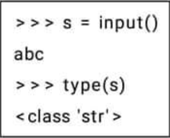

Trước tiên chúng ta cùng xem lại 2 "hàm số" đã biết trong bài trước là input() và print().

Hàm input() sẽ yêu cầu nhập một xâu ký tự từ bàn phím (từ đầu vào - input chuẩn) và trả lại chính xâu ký tự đó. Kiểu kết quả của hàm này là "str".

Ngược lại, lệnh (hay hàm số) print() sẽ không trả lại các giá trị cụ thể nào. Trong Python vẫn cho phép thực hiện lệnh gán, ví dụ a = print(3), tuy nhiên nếu kiểm tra thì kiểu giá trị của a sẽ là NoneType như ví dụ sau.

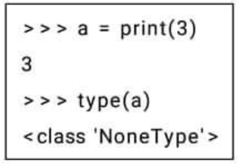

Biến nhớ a thuộc kiểu "NoneType" do vậy sẽ không thể thực hiện bất cứ phép tính nào ngoài lệnh gán.

Ví dụ:

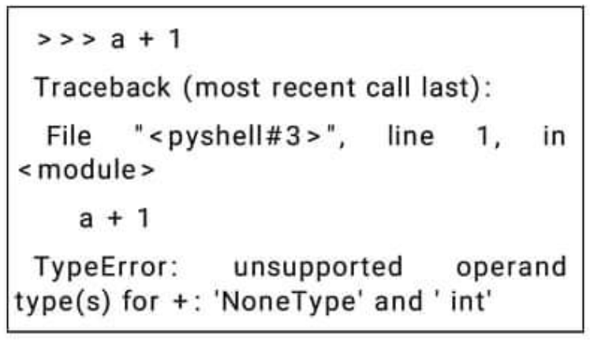

### 3. Phân loại hàm số

Trong Python hỗ trợ định nghĩa cả 2 kiểu hàm số đã nói trong phần trên: hàm không có giá trị (hàm void) và hàm có trả lại giá trị.

Trước tiên chúng ta làm quen với cách tạo các hàm trả lại giá trị. Các hàm này thường được gọi là hàm `void`. các hàm void còn được gọi là `thủ tục` trọng một số ngôn ngữ lập trình.

a) Định nghĩa hàm void (thủ tục)

Định nghĩa hàm void theo mẫu sau.

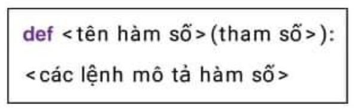

Chú ý: 
- Tên hàm số cần tuân thủ quy luật đặt tên trong Python.

- Phần thân của hàm số được viết thụt vào theo đúng quy định của Python. Định nghĩa hàm số phải kết thúc bằng ký hiệu.

- Trong thân của hàm số có thể có hoặc không có lệnh `return`. Lệnh `return` có tác dụng kết thúc ngay hàm số.

- Hàm số có thể không có hoặc có tham số. Có thể có nhiều tham số, viết cách nhau bởi dấu phẩy.

Ví dụ một hàm void đon giản nhất có thể định nghĩa ngay trên cửa số lệnh tương tác của Python.

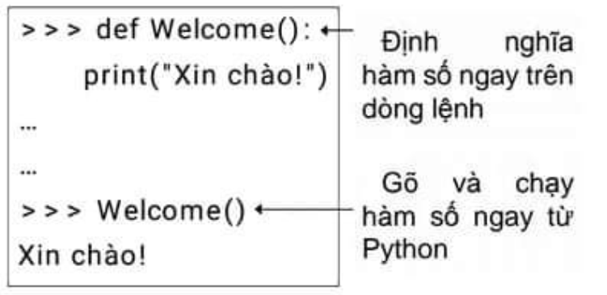

Hàm void khi đã định nghĩa sẽ được sử dụng như các lệnh thông thường.

> InputData.py

```python
def Welcome():
    print("Xin chào !")
def InputData():
    m = int(input("Nhập số m: "))
    n = int(input("Nhập số n: "))
    print("Tổng hai số m, n là:",m + n)
    return
Welcome()
InputData()
```

Ví dụ sau là một chương trình Python hoàn chỉnh. Chương trình được cấu trúc bởi 2 thủ tục hay hàm số void. Hàm số thứ 2 (InputData()) có lệnh return thông báo kết thúc nhập liệu.

Kết quả thực hiện chương trình trên như sau:

```
Xin chào !
Nhập số m: 12
Nhập số n: 35
Tổng hai số m, n là: 47
```

b) Định nghĩa hàm số có giá trị

Định nghĩa hàm số có giá trị

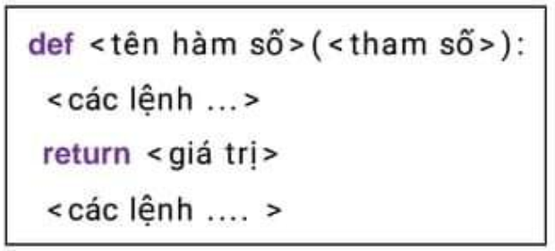

Chú ý:

- Trong phần thân của hàm số bắt buộc phải có lệnh return \<giá trị>, lệnh này có tác dụng dừng hàm số và trả lại giá trị cho hàm số.

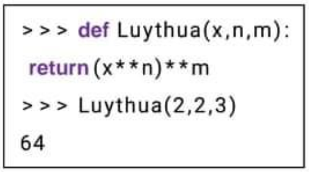

Ví dụ sau thiết lập hàm số Luythua(x,m,n) dùng để tính hàm lũy thùa 2 bậc theo công thức sau:

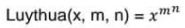

## II.BIẾN TOÀN CỤC VÀ BIẾN CỤC BỘ

### 1.Khái niệm

Các biến được khai báo để dùng riêng trong hàm số được gọi là biến cục bộ.

Ví dụ, trong hàm số Luythua(x, k) ở phần 1 thì j là biến cục bộ.

Nói chung, chương trình chính và các hàm số khác không thể sử dụng được các biến cục bộ của một hàm số, nhưng mọi hàm số đều sử dụng được các biến của chương trình chính. Do vậy, các biến của chương trình chính được gọi là biến toàn cục. Ví dụ, biến TLuythua khai báo trong chương trình chính ở ví dụ trên là biến toàn cục.

Một hàm số có thể có hoặc không có biến cục bộ.

### 2. Biến toàn cục trong Python

```python
x = "Biến toàn cục"

def vidu():
    print("x trong hàm vidu() :", x)

vidu()
```

Nguồn: https://quantrimang.com/bien-toan-cuc-global-bien-cuc-bo-local-bien-nonlocal-trong-python-147593

> print("x ngoài hàm vidu():",x)

Trong ví dụ trên, ta khai báo biến x là biến toàn cục, và định nghĩa hàm vidu() để in biến x. Cuối cùng ta gọi hàm vidu() để in giá trị của biến x. Chạy code trên ta sẽ được kết quả là:

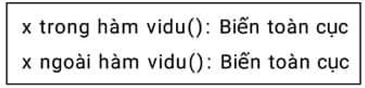

Chuyện gì sẽ xẩy ra nêu sbnaj thay đổi giá trị của x trong hàm?

```python
x = 2
def vidu():
    x = x*2
    print(x)
vidu()
```

Khi chạy code ở hình bên bạn sẽ nhận được thông báo lỗi.

Lỗi này xuất hiện là do Python xử lý x như một biến cục bộ và không được định nghĩa trong vidu().

### 3. Biến cục bộ trong Python

```python
def vidu():
    y = "Biến cục bộ"
vidu()
print(y)
```

Khi chạy code sau đây bạn sẽ nhận được thông báo lỗi:

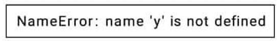

Lỗi này xuất hiện là do chúng ta đã cố truy cập vào biến cục bộ trong phạm vi toàn cục, nhưng y chỉ làm việc trong hàm vidu().

Thông thường, để tạo một biến cục bộ, chúng ta sẽ khai báo nó trong một hàm như ví dụ sau đây:

```python
def vidu():
    y = "Biến cục bộ"
    print(y)
vidu()
```

Chạy code trên ta sẽ được kết quả là `Biến cục bộ`

## III. THAM SỐ THỰC VÀ THAM SỐ LỰA CHỌN

### 1. Tham số thực sự của hàm số

Chúng ta sẽ tìm hiểu sâu hơn về cách truyền dữ liệu qua các tham số của hàm số. Trong các ví dụ đã đưa ở phần trên, tất cả các tham số đều bắt buộc phải truyền tham số từ lời gọi của hàm số, các tham số này gọi là `tham số thực sự (actual parameter)`. Ví dụ với hàm số trên cả 2 tham biến x, y đều là các tham số thực sự.

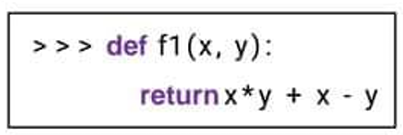

Hàm này có thể gọi đơn giản như sau: 

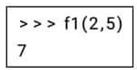

Tuy nhiên không thể gọi hàm nếu thiếu tham số truyền vào, ví dụ:

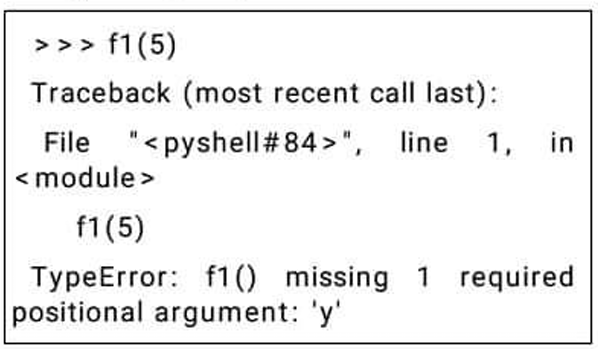

Chú ý thứ tự truyền tham số là quan trọng, ví dụ:

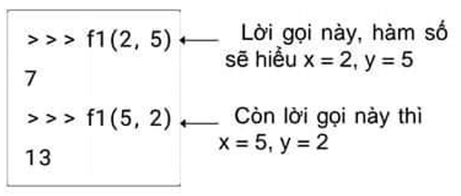

### 2. Tham số lựa chọn của hàm số

Trước khi tìm hiểu về cách tạo ra các tham số lựa chọn của hàm số trong Python, chúng ta cùng quan sát lại các ví dụ với hàm print().

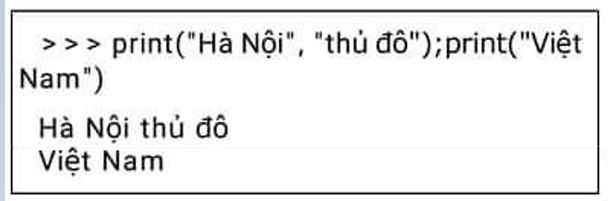

Chúng ta thấy gì?

- Lệnh tự động chèn các khoảng trống giữa các đối tượng cần in.

- Kết thúc lệnh sẽ tự động xuống dòng.

Quan sát lệnh tiếp theo, chúng ta sử dụng thêm 2 lựa chọn của lệnh sep = <...> và end = <...>

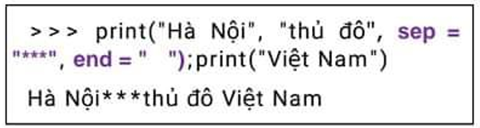

- Tham biến sep = <...> sẽ dùng giá trị thay thể cho thể hiện ngăn cách giữa các đối tượng cần in ra của lệnh.

- Tham biến end = <...> sẽ xác định thông tin được chèn vào cuối của lệnh print().

- Mặc định, giá trị của tham biến sep là dấu " ", của tham biến end là ký tự điều khiển xuống dòng "\n".

Cú pháp đầy đủ hơn của print() là:

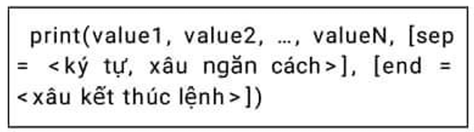

Các tham biến dạng sep = <...> hay end = <...> trong lệnh print() trên được gọi là các `tham biến lựa chọn`. Các tham biến lựa chọn có ý nghĩa như sau:

> Ghi nhớ

- Tham biến lựa chọn luôn cần gán mặc định trong định nghĩa của hàm.

- Trong lời gọi hàm có thể vắng mặt tham số lựa chọn, khi đó giá trị mặc định của tham biến này sẽ được gán trực tiếp. 

- Có thể có một hoặc nhiều tham biến lựa chọn.

### 3. Định nghĩa hàm số có tham só lựa chọn

Python cho phép khởi tạo dễ dàng các hàm số có tham biến lựa chọn. Cách mô tả các tham biến lựa chọn là có thêm dấu = và sau đó là giá trị mặc định được gán cho tham số này.

`\<tham số lựa chọn> = \<giá trị mặc định>`

Cú pháp định nghãi hàm số đầy đủ trong Python.

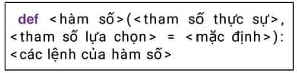

Chú ý quan trọng:

- Các tham số lựa chọn bắt buộc phải được mô tả sau các tham số thực.

Ví dụ sau cho thấy không thể đặt các tham số lựa chọn trước tham số thực sự.

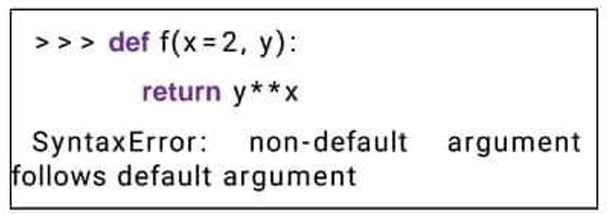

Chú ý:

- Các tham số lựa chon trong Python gọi là `non-default argument`. 

- Các tham số thực sự trong Python gọi là `default argument`.

Với một ví dụ đơn giản về hàm số có tham số lựa chọn.

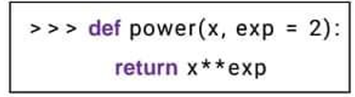

Chúng ta có thể thực hiện các lời gọi đa dạng như sau.

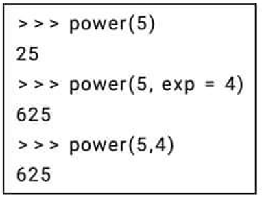

## IV. HÀM ĐỊNH NGHĨA TRỰC TIẾP

Trong python ngoài cách định nghĩa hàm số chính thống thông qua từ khóa def, còn có một cách định nghĩa nhanh hàm số khác nếu hàm số được tính bằng công thức. Các tạo hàm số này còn được gọi là hàm vô danh hay hàm lambda.

Hàm lambda bắt buộc phải trả về giá trị bằng một biểu thức tính toán. Hàm có thể có một hoặc nhiều tham số.

Cú pháp định nghĩa hàm lambda như sau:

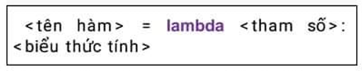

Chú ý phần \<tham số> có thể có nhiều tham biến.

Ví dụ hàm d() được định nghĩa trực tiếp bằng công thức d(x, y) = x² + y². Hàm này được định nghĩa trực tiếp như sau:


## V. MỘT SỐ VÍ DỤ CỦA HÀM SỐ.

Ví dụ 1. Hàm Nguyento(m) đơn giản sau sẽ trả lại 1 nếu m là nguyên tố, ngược lại sẽ trả về 0 nếu m là hợp số.

```python
def Nguyento(m):
    S = 0
    for i in range(1, m):
        if m % i == 0:
            S = S + 1
    if S == 1:
        return 1
    else:
        return 0
```

Chương trình sau mô tả một cách dùng đơn giản của hàm này. Chương trình yêu cầu nhập một số tự nhiên, sau đó thông báo ra màn hình số này là nguyên tố hay hợp số.

Thuật toán: đếm số các ước số thực sự của m, lưu vào biến đếm S. Nếu S = 1 thì m là nguyên tố.

```python
def Nguyento(m):
    S = 0
    for i in range(1, m):
        if m % i == 0:
            S = S + 1
    if S == 1:
        return 1
    else:
        return 0

m = int(input("Nhập số tự nhiên m:"))

if Nguyento(m) == 1:
    print(m, "là số nguyên tố")
else:
    print(m, "không là số nguyên tố")
```

Ví dụ 2 đơn giản nhưng khá thú vị. Hàm số sẽ trả lại một dãy số (chứ không phải là một giá trị duy nhất).

Hàm Dayso(m) sau sẽ trả lại 2 giá trị là số các ước số thực sự của m và số các ước số nguyên tố của m.

S1 = Số các ước số thực sự của m tính cả 1.

S2 = biến đếm số các ước số thực sự của m là nguyên tố.

Kết quả chạy chương trình này có thể như sau:

```
Nhập số tự nhiên m: 20
(5, 2)

Nhập số tự nhiên m: 100
(8, 2)
```

```python
def Dayso(m):
    S1 = S2 = 0

    for i in range(1, m):
        if m % i == 0:
            S1 = S1 + 1

    for k in range(2, m):
        if m % k == 0:
            s = 0
            for i in range(1, k):
                if k % i == 0:
                    s = s + 1
            if s == 1:
                S2 = S2 + 1

    return S1, S2

m = int(input("Nhập số tự nhiên m:"))

print(Dayso(m))
```

Ví dụ 3. Viết hàm số ve_Hcn để vẽ hình chữ nhật với kích thước chdai và chrong.

```python
def Ve_Hcn(chdai, chrong):
    for i in range(chdai):
        print('*', end='')
    print()

    for i in range(chrong - 2):
        print('*', end='')
        for i in range(chdai - 2):
            print(' ', end='')
        print('*')

    for i in range(chdai):
        print('*', end='')

Ve_Hcn(5, 3)
```

Ví dụ 4. Viết chương trình thực hiện việc rút gọn một phân số. trong đo scos sử dụng hàm tính ước chung lớn nhất (UCLN) của hai số nguyên.

```python
a, b = eval(input("Nhập tử và mẫu:"))

def UCLN(a, b):
    while b != 0:
        t = a % b
        a, b = b, t
    return a

x = UCLN(a, b)

if x > 1:
    a //= x
    b //= x

print("Phân số đã rút gọn là", a, "/", b)
```

Ví dụ 5. Chương trình sau cho biến giá trị nhỏ nhất trong ba số nhập từ bàn phím trong đó có sử dụng hàm tìm số nhỏ nhất trong hai số.

```python
def NhoNhat(a,b):
    if a < b:
        return a
    else:
        return b
a,b,c = eval(input("Nhập 3 số a,b,c: "))
print(NhoNhat(NhoNhat(a,b),c))
```

`BÀI TẬP TỰ LUẬN`

1. Sau khi thực hiện đoạn chương trình sau thì giá trị kq là bao nhiêu?

```python
def calc(x):
    kq = 4 * x - 1
    return kq

calc(7)
```

a) 27
b) 1
c) 7
d) 0

2. Đoạn chương trình sau sẽ in ra kết quả là

```python
def f(x):
    return x**2, x**x*x**x
x, y = f(2)
print(x+y)
```

a) 10          b) 20
c) 16          d) Chương trình báo lỗi.

3. Viết các hàm lambda mô tả các biểu thức sau:

a) x + y + z

b) x ** (y + z)

c) (x + y) ** 2

4. Viết hàm số f(n) với tham số n là số tự nhiên theo yêu cầu sau.

a) Hàm trả lại số các ước số thực sự của n.

b) Hàm trả lại 1 nếu n là nguyên tố, ngược lại hàm trả về 0.

c) Hàm đếm số các ước số là lẻ của n.

d) Hàm đếm số các ước số nguyên tố của n.

e) Hàm tính tổng tất cả các ước số thực sự của n.

5. Viết hàm số f(m, n) với m, n là số tự nhiên theo yêu cầu sau.

a) Hàm đếm số các ước chung của các số m, n.

b) Hàm đếm số các ước số của m nhưng không là ước số của n.

c) Hàm tính tổng các ước số chung của m và n.

6. Viết hàm số Radian(d), tham số đầu vào là số thực là số đo góc theo độ bình thường. Hàm sẽ trả lại số đo của d theo radian. Công thức chuyển đổi là: R = d × π / 180.

7. Viết hàm số Degree(R), tham số đầu vào là số đo góc theo đơn vị radian. Hàm sẽ trả lại số đo góc theo độ bình thường. Công thức chuyển đổi là: d = R × 180 / π.

8. Sau đoạn chương trình sau, biến nhớ R nhận giá trị nào?

>>> def f(x, y, R):
        R = x**2 + y**2
        return

>>> R = 1

>>> f(3,4,R)

a) 25
b) 1
c) 0
d) Ngẫu nhiên.

9. Một hàm (thủ tục) khi khai báo có 3 tham số,ví dụ, f(x, y, z). Nhưng khi gọi hàm, lời gọi chỉ có 2 tham số, ví dụ f(x, y). Điều đó có thể thực hiện được hay không trong Python?

10. Viết thủ tục convert() thực hiện các công việc sau:

- Yêu cầu nhập từ bàn phím số giờ, phút,giây (tính theo số nguyên).

- Sau đó đổi tổng số thời gian này ra ngày(tính theo float).

- Hiển thị kết quả ra màn hình.

Ví dụ thủ tục này chạy như sau.

```
Nhập số giờ: 100
Nhập số phút: 43
Nhập số giây: 56
4.197175925925926
```

11. Đoạn chương trình sau có lời gọi hàm f(x) ở cuối.


Kết quả thực hiện trả lại giá trị nào?

a) 1

b) 0

c) Chương trình báo lỗi.

12. Viết các thủ tục thực hiện các công việc sau:

a) Tham số là số tự nhiên n, in ra màn hình kết quả tổng các số 1 + 2 + ... + n.

b) Tham số là số tự nhiên s chỉ số giây, thông báo số giờ, phút, giây mà giá trị s này chuyển sang.

c) Tham số là hai số thực a, b, trả lại giá trị là trị tuyệt đối |a − b|.

d) Viết hàm số factorial(n) tính giá trị là tích các số 1·2...n (gọi là n giai thừa).

# CHỦ ĐỀ 6: KIỂU DỮ LIỆU CÓ CẤU TRÚC 

## I. KIỂU DỮ LIỆU LIST. MẢNG MỘT CHIỀU.

### 1. Bài toán

