#  CHỦ ĐỀ 1: MỘT SỐ KHÁI NIỆM VỀ LẬP TRÌNH VÀ NGÔN NGỮ LẬP TRÌNH

## I. KHÁI NIỆM LẬP TRÌNH VÀ NGÔN NGỮ LẬP TRÌNH.

Như ta biết, mọi bài toán có thuật toán đều có thể giải được trên máy tính điện tử. Khi giải bài toán trên máy tính điện tử. Khi giải bài toán trên máy tính điện tử, sau các bước xác định bài toán và xây dựng hoặc lựa chọn thuật toán khả thi là bước lập trình.

Lập trình là sử dụng cấu trúc dữ liệu và các câu lệnh của ngôn ngữ lập trình cụ thể mô tả dữ liệu và diễn dạt các thao tác của thuật toán. Chương trình viết bằng ngôn ngữ lập trình bậc cao nói chung không phụ thuộc vào loại máy, nghĩa là một chương tình có thể thực hiện trên nhiều loại máy tính khác nhau. Chương trình viết bằng ngôn ngữ máy tính có thể được nạp trực tiếp vào bộ nhớ và thực hiện ngay, còn chương trình việt bằng ngôn ngữ lập trình bậc cao phải được chuyển đổi thành chương trình trên ngôn ngữ mãy mới có thể thực hiện được.

Chương trình đặc biệt có chức năng chuyển đổi chương trình được viết bằng ngôn ngữ lập trình bậc cao thành chương trình thực hiện được trên máy tính được gọi là chương trình dịch.

Chương trình dịch nhân đầu vào là chương trình viết bằng ngôn ngữ lập trình bậc cao (chương trình nguồn), thực hiện chuyển đổi sang ngôn ngữ máy (chương trình đích).


Xét ví dụ, bạn chỉ biết tiếng việt nhưng cần giới thiệu về trường của mình cho đoàn khác đến từ nước Mĩ, chỉ bằng tiếng anh. Có hai cách để bạn thực hiện điều này.

Cách thứ nhất: Bạn nói bằng tiếng việt và người phiên dịch giúp bạn dịch sang tiếng Anh. Sau mỗi câu hoặc một vài câu giới thiệu trọn một ý, người phiên dịch sang tiếng Anh cho đoàn khách. Sau đó, bạn lại giới thiệu tiếp và người phiên dịch lại dịch tiếp. Việc giới thiệu của bạn và việc dịch lại dịch tiếp. Việc giới thiệu của bạn và việc dịch của người phiên dịch luân phiên cho đến khi bạn kết thúc nội dung giới thiệu của mình. Cách dịch trực tiếp như nậy gọi là thông dịch.

Cách thứ hai: Bạn soạn nội dung giới thiệu của mình ra giấy, người phiên dịch dịch toàn bộ nội dung đó sang tiếng Anh rồi đọc hoặc trao văn bản đã dịch cho đoàn khách đọc. Như vậy, việc dịch được thực hiện sau khi nội dung giới thiệu đã hoàn tất. Hai công việc đó được thực hiện trong hai khoảng thời gian độc lập, tách biệt với nhau. Cách dịch như vậy được gọi là biên dịch.

Sau khi kết thúc, với cách thứ nhất không có một văn bản nào để lưu trữ, còn với cách thứ hai có hai bản giới thiệu về trường của bạn bằng tiếng Việt và bằng tiếng Anh có thể lưu trữ để dùng lại về sau.

Tương tự như vậy, chương trình dịch có hai loại là _thông dịch_ và _biên dịch_

a) Thông dịch

Thông dịch (interpreter) được thực hiện bằng cách lặp lại dãy các bước sau:

1. Kiểm tra đúng đắn của câu lệnh tiếp theo trong chương trình nguồn.
2. Chuyển đổi câu lệnh đó thành một hay nhiều câu lệnh tương ứng trong ngôn ngữ máy
3. Thực hiện các câu lệnh vừa chuyển đổi được.

Như vậy, quá trình dịch và thực hiện các câu lệnh là luân phiên. Các chương tình thông dịch lần lượt dịch và thực hiện từng câu lệnh. Loại chương tình dịch này đặc biệt thích hợp cho môi trường đối thoại giữa người dùng và hệ thống. Tuy nhiên, một câu lệnh nào đó phải thực hiện bao nhiêu lần thì nó phải được dịch bấy nhiêu lần.

Các ngôn ngữ khai thác hệ quản trị cơ sở dữ liệu, ngôn ngữ đối thoại với hệ điều hành,... đều sử dụng trình thông dịch.

b) Biên dịch

Biên dịch (compiler) được thực hiện qua hai bước: 
1. Duyệt, phát hiện lỗi, kiểm tra tính đúng đắn của các câu lệnh trong chương trình nguồn.
2. Dịch taofn bộ chương trình nguồn thành một chương trình đích có thể thực hiện trên máy tính và có thể lưu trữ để sử dụng lại khi cần thiết.

Như vậy, trong thông dịch, không có chương trình đích để lưu trữ, trong biên dịch cả chương trình nguồn và chương trình đích có thể lưu trữ để sử dụng về sau.

Thông thường, trong môi trường làm việc trên một ngôn ngữ lập trình cụ thể, ngoài chương trình dịch còn có một số thành phần có chức nang liên quan như biên soạn, lưu trữ, tìm kiếm, cho kết quả trung gian,...

Các môi trường lập trình khác nhau ở những dịch vụ mà nó cung cấp, đặc biệt là dịch vụ nâng cấp. tăng cường các khả năng mới cho ngôn ngữ lập trình.

Bài tập tự luận
1. Tại sao người ta phải xây dựng các ngôn ngữ lập trình bậc cao?
2. Chương trình dịch là gì? Tại sao cần phải có trình dịch?
3. Biên dịch và thông dịch khác như thế nào?

## II. CÁC THÀNH PHẦN CỦA NGÔN NGỮ LẬP TRÌNH
### 1. Các thành phần cơ bản

Mỗi ngôn ngữ lập trình thường có ba thành phần cơ bản là bảng chữ cái, cú pháp và ngữ nghĩa.

a) Bảng chữ cái là tập các kí tự được dùng để viết chương trình. Không được phép dùng bất kì kí tự nào ngoài các kí tự quy định trong bảng chữ cái.

Trong Python, bảng chữ cái bao gồm các kí tự sau:
- Các chữ thường và các chữ cái in hoa của bảng chữ cái tiếng Anh:


- 10 chữ số thập phân Ả Rập:


- Các kí tự đặc biệt

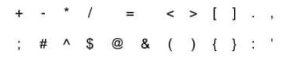

dấu cách (mã ASCII 32)    _

Lưu ý thêm: python sử dụng mặc định bảng mã Unicode thay vì ASCII như Pascal. Như vậy, khái niệm "bảng chữ cái" trong Python là các kí tự trong bảng mã Unicode. Tên biến và các đói tượng trong chương trình python có thể đặt bằng tiếng việt có dấu.

b) Cú pháp là bộ quy tắc để chương trình.

Dựa vào chúng, người lập trình và chương trình dịch biết được tôt hợp nào của các kí tự trong bảng chữ cái là hợp lệ và tổ hợp nào là không hợp lệ. Nhờ đó, có thể môt tả chính xác thuật toán để máy thực hiện.

C) Ngữ nghĩa xác định ý nghĩa thao tác cần phải thực hiện, ứng với tổ hợp kí tự dựa nào ngữ cảnh của nó.

Ví dụ 

Phần lớn các ngôn ngữ lập trình đều sử dụng dấu (+) để chỉ cộng phép cộng. Xét các biểu thức:

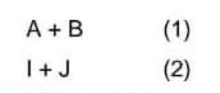

Giả thiết A,B là các đại lượng nhận giá trị thực và I,J là các đại lượng nhận giá trị nguyên. Khi đó dấu "+" trong biểu thức (1) được hiểu là cộng hai số thực, dấu "+" trong biểu thức (2) được hiểu là cộng hai số nguyên. Như vậy ngữ nghĩa dấu "+" trong hai ngữ cảnh khác nhau là khác nhau.

Tóm lại, cú pháp cho biết cách viết một chương trình hợp lệ, còn ngữ nghĩa xác định ý nghĩa của các tổ hợp kí tự trong chương trình. 

Các lỗi cú pháp được chương tình dịch phát hiện và thông báo cho người lập trình biết. Chỉ có các chương trình không còn lỗi cú pháp mới được dịch sang ngôn ngữ máy.

Các lỗi ngữ nghĩa khó phát hiện. Phần lớn các lỗi nghữ nghĩa chỉ được phát hiện khi thực hiện chương tình trên dữ liệu cụ thể.

### 2. Một số khái niệm

a) Biến nhớ

Có thể tóm tắt quy tắc đặt tên biến nhớ trong Python như sau:

- Phân biệt chứ hoa và chữ thường.
- chỉ có thể chữa kí tự là chữ, chữ số, dấu gạch dưới và không cho phép chứa bất kì các ký tự khác.
- Tên biến nhớ phải bắt đầu bằng chữ cái hoặc dấu _ (dấu gạch dưới), không được phép bắt đầu bằng chữ số.

Ví dụ Các tên biến sau là hợp lệ: ab_1, _ bien_nho, xyz, x_y_z.

b) Từ khóa

Từ khóa được định nghĩa sẵn để sử dụng. Chúng ta không thể dùng keyword để đặt tên biến, tên hàm hoặc bất kỳ đối tượng nào trong chương trình.

Tất cả các keyword trong Python đều được viết thường, Trừ 03 keyword: True, False, None.

Thực tế thì không cần nhớ keyword vì khi gõ trình soạn thảo sẽ gợi ý các keyword (ta tránh đặt tên đối tượng trùng với các keyword được gợi ý) và nếu đặt trùng tên keyword thì khi chạy chương trình sẽ báo lỗi.

Từ khóa là các từ mà Python đã dùng cho các mục đích riêng của ngôn ngữ hoặc dành cho các hàm hệ thống.

Sau đây là các từ khóa có trong chương trình học.

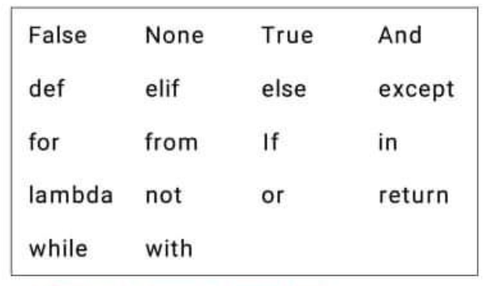

c) Ghi chú trong chương trình

Có thể dặt các đoạn chú thích trong chương tình nguồn. Các chú thích này giúp cho người đọc chương trình nhận biết ý nghĩa của chương trình đó dễ hơn. Chú thích không ảnh hưởng đến nội dung chương trình nguồn và được chương trình dịch bỏ qua.

Ghi chú (comment) lệnh trong Python được bắt đầu bằng ký tự # và có tác dụng từ vị trí này đến cuối dòng hiện thời.

Ví dụ một cách ghi chú lệnh trong Python.

``` python
x = 2 # gán 2 cho biến x
print(x)
```
> 2

Còn đây là ghi chú sai

``` python
/* ghi chú */
SyntaxError: invalid syntax

x = 2 /* ghi chú */
SyntaxError: invalid syntax
```

BÀI TẬP TỰ LUẬN

1. hãy cho biết các điểm khác nhau giữa biến nhớ và từ khóa.
2. Có thể đặt tên biến nhớ trùng với từ khóa của Python hay không?
3. Đặt tên biến nhớ như sau có được không

    a) a-b-c

    b) a_b_c

    c) _ \_abc\_ _
    
    d) -a_b_c-

4. Các tên sau có hợp lý trong Python không?

    a) 1_abc

    b) A.B.C

    c) _ _ \_1\_

    d) 1.abc

    e) a&b&c

5. Đặt tên các biến nhớ như sau có hợp lệ không?
    
    a) None

    b) none

    c) Việt Nam

    d) x y z

    e) True

    f) happy-day

## III. LÀM QUEN VỚI MÔI TRƯỜNG TƯƠNG TÁC PYTHON

### 1.Kiểu dữ liệu trong Python

a. Lệnh type() và kiểu dữ liệu chính trong Python.

Lệnh type(\<data>) sẽ trả lại kiểu dữ liệu hiện thời của \<data>

Quan sát và thực hiện các lệnh sau.


Các kiểu dữ liệu cơ bản trong Python bao gồm:

- int: số nguyên.
- float: số thực với dấu phẩy động.
- bool: logic với 2 giá trị True và False.
- str: xâu kí tự.

b) Biến nhớ không cần khai báo và xác định kiểu dữ liệu

Một đặc điểm đặc biệt của Python là các biến nhớ không cần khai báo và không cần xác định kiểu dữ liệu trước.

Cùng xem đoạn chương trình sau:


Ở dòng đầu tiên khi gõ x, Python sẽ khong nhận ra vì x chưa được gán bất cứ giá trị nào. Ở lần tiếp theo khi đã gán x = 1 thì biến nhớ x đã được xác định.

Trong Python, các biến nhớ chỉ xác định kiểu dữ liệu tại thời điểm gán trị, do đó biến nhớ không cần khai báo kiểu dữ liệu trước. Một biến nhớ có thể nhận nhiều kiểu giá trị khác nhau mà không cần khai báo lại.

Xem đoạn chương trình sau, biến nhớ x có thể nhận các giá trị với kiểu dữ liệu lần lượt là float, int, bool và str.

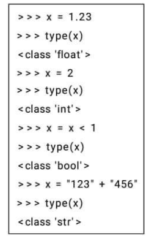

### 2 Biểu thức số học trong Python

Biểu thức số học trong Python có thể được viết và tính dễ dagnf như trong mọi ngôn ngữ lập trình bậc cao khác. Biểu thức có thể chứa giá trị số hoặc biến nhớ, hàm số có giá trị.

Xét các ví dụ sau:

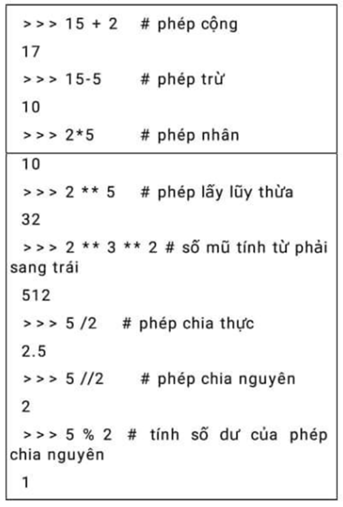

Bảng các phép tính trong Python như sau: 

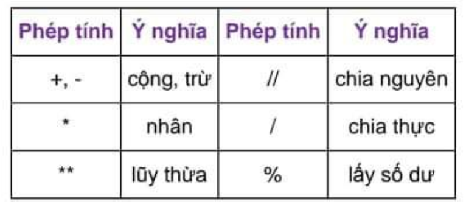

Chú ý: Biểu thức số học có dạng tương tự như cách viết tỏng toán học với những quy tắc sau

- Chỉ dùng cặp ngoặc tròn để xác định trình tự thực hiện phép toán trong trường hợp cần thiết;

- Không được bỏ qua dấu nhân (*) trong tích.

- Trong một số trường hợp nên dùng biến trung gian để có thể tránh được việc tính một biểu thức nhiều lần.

Riêng phép lũy thừa ** được tính từ phải qua trái

Ví dụ

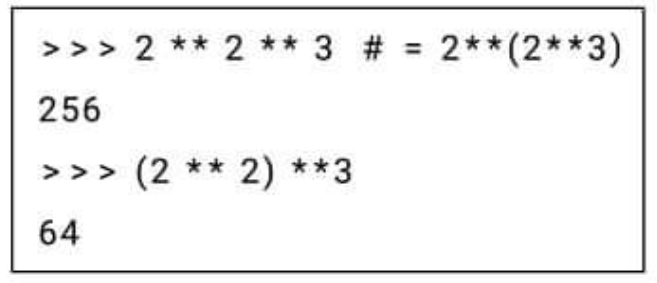

Trong biểu thức có cả +, - và *, /, //, % thì phép nhân, chia, % được ưu tiên hơn cộng, trừ.

> 2 + 2/2 = 3.0

Phép tính lấy số dư % và chia nguyên // nếu số chia hoặc số bị chia là kiểu float thì kết quả sẽ chuyển đổi sang kiểu float. Ví dụ:

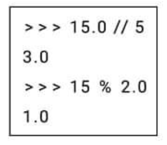

Dãy các biểu thức có thẻ viết trên một dòng lệnh, cách nhau bởi dấu phẩy như sau: 

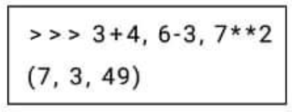

Trong ví dụ trên nếu biểu thức phân cách bởi dấu ";" thì Python sẽ hiểu là các lệnh khác nhau và kết quả sẽ như nhau:

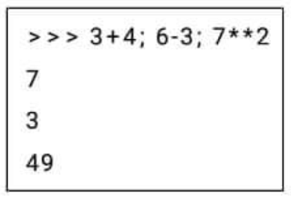

### 3. Hàm số học chuẩn

Để sử dụng các hàm này trong Python chúng ta thực hiện lệnh import math.

Ví dụ. Trước khi dùng hàm sqrt() ta phải thực hiện import module math như sau: 

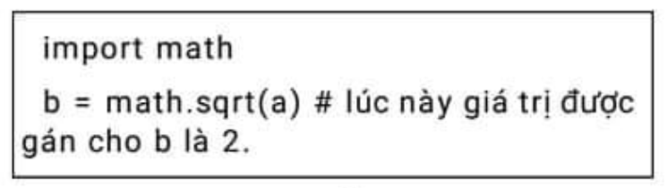

Lưu ý: Hàm abs(x) có sẵn, không thuộc module math.

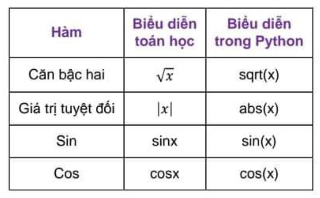

### 4. Dữ liệu kiểu bool

Dữ liệu kiểu bool (logic) là loại dữ liệu chỉ có 2 giá trị Đúng (True) và Sai (False). Dữ liệu bool được dùng khi mô tả các ddieuf kiện hoặc phép so sánh số hoặc chữ.

Trong Python, 2 giá trị chính của kiểu dữ liệu này là True và False. Hàm bool() sẽ kiểm tra xem giá trị của đối số của hàm là True hay False

Cùng xem một số ví dụ sau.

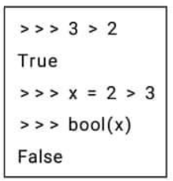

Ở lệnh đầu tiên, khi gõ 3 > 2, đó chính là một biểu thức logic với phép so sánh, biểu thức này có giá trị bool là True (đúng).

Ở lệnh thứ hai, phép gán x = 2 > 3, biểu thức logic 2 > 3 nhận giá trị False được gán cho biến nhớ x và x sẽ nhận giá trị False (sai).

Phép so sanh số là cách đơn giản nhất để tạo ra các kiểu dữ liệu logic này. Bảng sau mô tả quy tắc ghi các phép so sánh số trong Python.

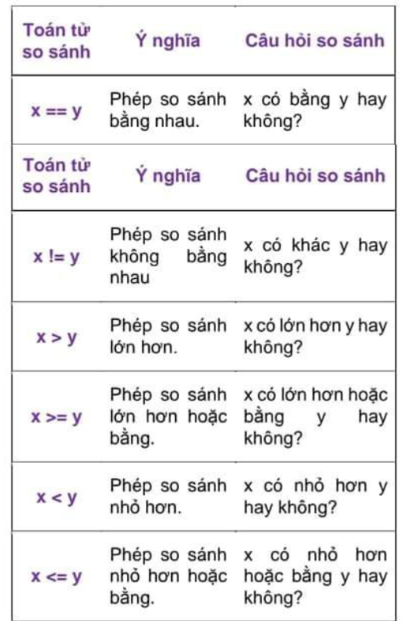

Có 3 phép toán chính với kiểu dữ liệu bool là and (và), or (hoặc), và not (phủ định).

Bảng giá trị của các phép toán này được định nghĩa như sau.

Phép toán và and

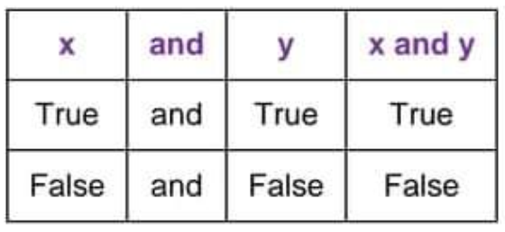

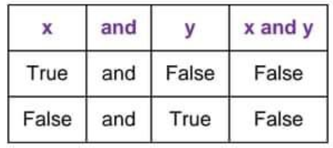

Phép toán hoặc or 

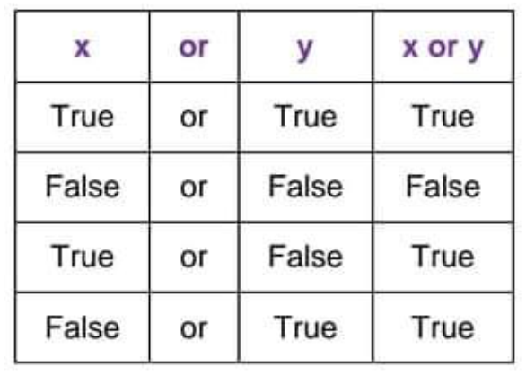

Phép toán phủ định not

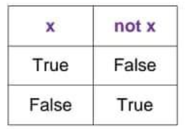

Phép toán not được viết trước biểu thức cần phủ định, ví dụ:

not (x < 1) thể hiện phát biểu "x không nhỏ hơn 1" và điều này tương đương với biết thức quan hệ x >= 1.

Các phép toán not, and và or có thể được dùng chung với nhau. Thứ tự ưu tiên của các phép toán này là not > and > or.

### 5. Câu lệnh gán

a) Lệnh gán

Lệnh gán đơn giản nhất của Python có dạng:

\<biến nhớ> = \<giá trị>

Ví dụ:

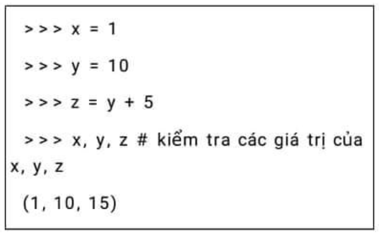

Chúng ta đã biết kiểu của biến nhớ chỉ được xác định tại thời điểm thực hiện lệnh gán.

Trong ví dụ sau, ban đầu x và y được gián các giá trị nguyên, do đó sẽ có kiểu int. Nhưng ở lần sau, y được gán một phép tính thực, và do đó y sẽ nhận kiểu giá trị float.

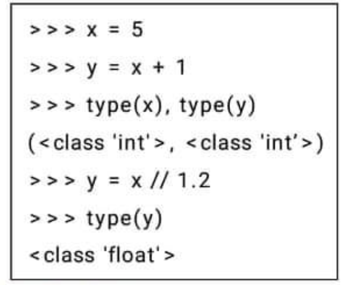

b) Gán đồng thời

Nếu các biến nhớ có giá trị bằng nhau thì có thể gán bằng một lệnh như sau:

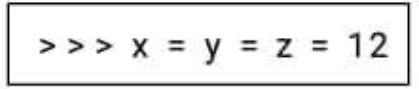

Việc gán đồng thời nhiều biến nhớ với cá giá trị khác nhau có thể thực hiện như sau:

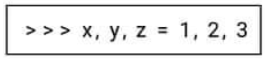

Chú ý: không được viêt như sau, ví dụ: x = 1, y = 2, z = 3.

Phép gán đồng thời trong Python có rất nhiều ý nghĩa. Ví dụ chúng ta muốn đổi giá trị 2 biến nhớ x, y. Với Python và lệnh gán đồng thời các biến nhớ, việc đổi giá trị 2 biến nhớ x, y được thực hiện chỉ bằng một câu lệnh như sau.

> x, y = y, x

Ví dụ:

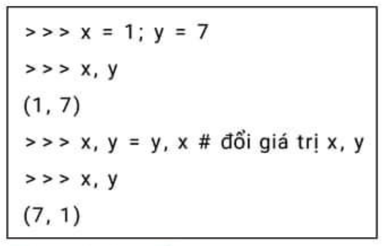

c) Phép gán thay đổi 

Phép gán thay đổi là lệnh có dạng:

> \<biến nhớ> \<phép toán> = \<giá trị>

Chức năng của lệnh: thay đổi \<biến nhớ> một giá trị bằng \<giá trị> bởi phép toán \<phép toán>.

Ví dụ: xem bảng.

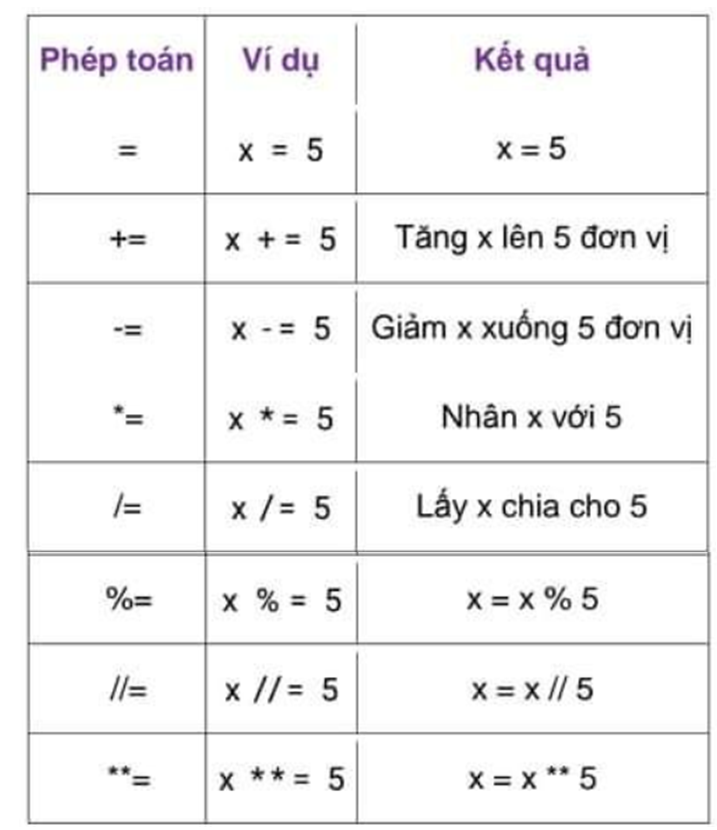

BÀI TẬP TỰ LUẬN

1. Em hãy giải thích vì sao một biến nhớ trong Python tại cá thời điểm khác nhau có thể gán các giá trị dữ liệu có kiểu khác nhau.

2. Dãy chữ số 2021 có thể thuộc những kiểu dữ dữ liệu nào?

3. Viết các biểu thứ toán dưới đây với các kí hiệu trong Python:

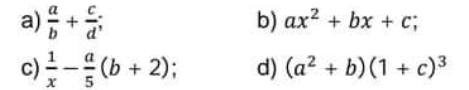

4. Chuyển các biểu thức được biết trong Python sau thành cá biểu thức toán:

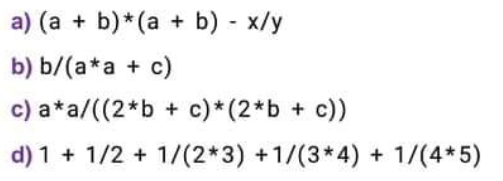

5. Hãy xác định kết quả của cá phép so sánh sau đây:

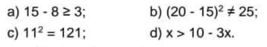

6. Viết các biểu thức ở bài tập 5 theo quy ước của Python.

7. Sau các lệnh: thì giá trị y bằng bao nhiêu?

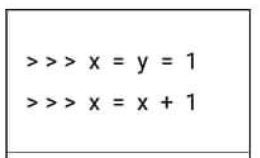

8. Sau các lệnh: thì giá trị y bằng bao nhiêu?

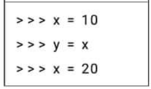

9. Sau các lệnh: Thì giá trị các biến nhớ x, y thay đổi như thế nào so với trước khi thực hiện các lệnh này?

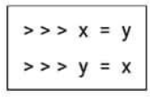

10. Các leemnhj gán sau đây là đúng hay sai trong Python:

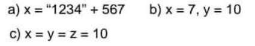

11. Hai biểu thức (2 ** 3) ** 4 và 2 ** 3 ** 4 có giá trị giống nhau hay khác nhau ?

12. Nếu a,b đồng thời là số nguyên thfi giá trị các biểu thức a / b và a // b cod đồng nhất với nhau không?

13. Giải sử ss = giá trị trính bằng số giây cho trước. Khi đó muốn đổi giá trị này ra phút và giờ thì dùng các công thức tính nào? Chú ý chỉ cần tính tròn phút và tròn giờ.

14. Công thức tienhs theo radian (rad) của một góc tính băng độ (angle) như sau:

Rad = angle x 3.14/180.

Viết lệnh bằng Python mô tả công thức trên.

15. Sau các lệnh sau thì x, y nhận các giá trị nào?

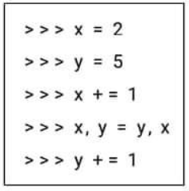

16. Có thể tính biểu thức 1+2+3+...+10 chỉ bằng 4 lệnh trong python hay không, trong đó tất cả các biểu thức tính toán của các lệnh này có thể không quá 2 phép cộng?

17. Cho trước các giá trị s tính bằng giây, m tính bằng phút, h tính bằng giờ, d tính bằng ngày. Viết công thức đổi giá trị "d ngày, h giờ, m phút, s giây" ra:

- a) giây.
- b) phút.
- c) giờ.

18. Chuyển các biểu thức trong Python sang biểu thức toán học tương ứng:

- a) a/b*2;
- b) a\*b*c/2;
- c) 1/a*b/c;

BÀI TẬP THỰC HÀNH

Bài 1: Luyện tập gõ các biểu thức số học trong chương trình Python.

a. Viết các biểu thức toán học sau đây dưới dạng biểu thức trong Python.

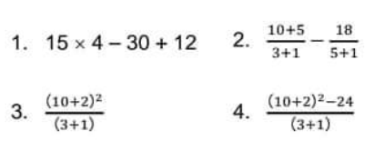

b. Khởi động chương trình Python và gõ các lệnh sau để tính các biểu thức trên.

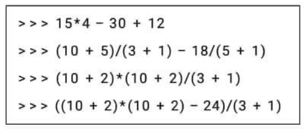

Bài 2: Tìm hiểu các phép chia lấy phần nguyên và phép chia lấy phần dư với số nguyên. Gõ các câu lệnh sau đây:

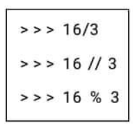

Bài 3: Viết chương trình tính tổng hiệu tích thương của 2 số a và b với a, b được nhập từ bàn phím.

```python
a = float(input("Nhập số thực a:"))
b = float(input("Nhập số thực b:"))

print("Tổng của hai số vừa nhập =", a + b)

print("Hiệu của hai số vừa nhập =", a - b)

print("Tích của hai số vừa nhập =", a * b)

print("Thương của hai số vừa nhập =", a / b)
```

# CHỦ ĐỀ 2: INPUT/OUTPUT VÀ CHUYỂN ĐỔI DỮ LIỆU

## I. LỆNH PRINT
### 1. In dòng chữ "Hello World"

Chúng ta sẽ bắt đầu làm quen với lệnh print. Chú ý Python phân biệt chữ hoa, chữ thường, do vậy print khác với Print.

Ví dụ chương trình sau sẽ in dòng chữ "Hello World !!" trên màn hình

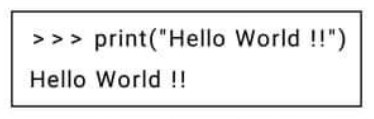

Xâu ký tự ghi trong tham số của lệnh print có thể viết dưới dạng "Hello World !!" hoặc "Hello World!!"

Nếu viết sai lệch, ví dụ nếu gõ lệnh "Print", lỗi sẽ xẩy ra và thông báo ngay.

### 2. Hello World.py - chương trình đầu tiên

Chúng ta sẽ viết một chương trình hoàn chính đầu tiên trên Python. Các tệp chương trình của Python đều có phần mở rông *.py và được soạn thảo bởi các phần mền IDE bất kì, miễn sao hỗ trợ Python

> Hello World.py

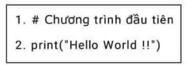

Để chạy chương trình này, chúng ta thực hiện lệnh Run --> Run Module Hoặc bấm F5

### 3. Cú pháp của lệnh print

Cú pháp của lệnh print là:

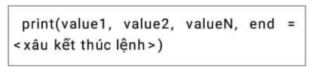

Trong đó:

- value1, value2, valueN là các giá trị cần in ra, các giá trị cần in có thể là số, xâu ký tự, biểu thức hay biến nhớ.
- end = ký tự, dấu kết thúc của lệnh print. Mặc định giá trị này là xâu điểu khiển xuống dòng (kết thúc 1 dòng)

### 4.Tham số end của hàm print()